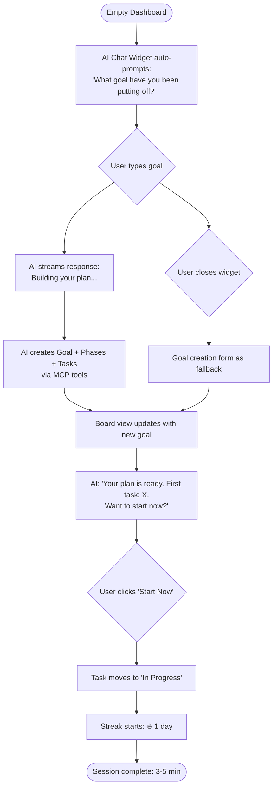
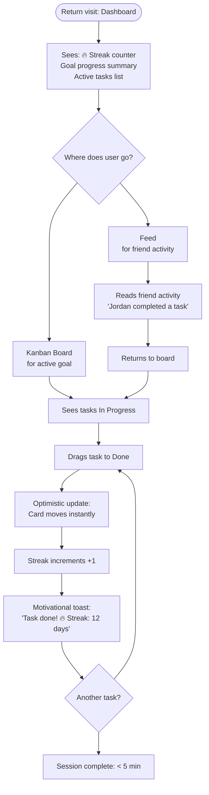
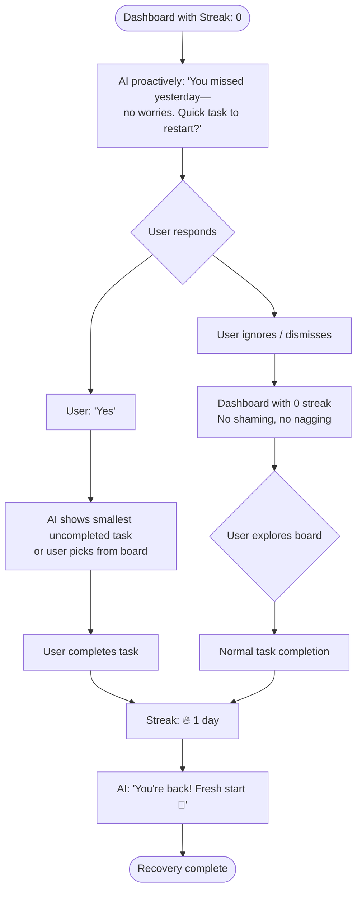
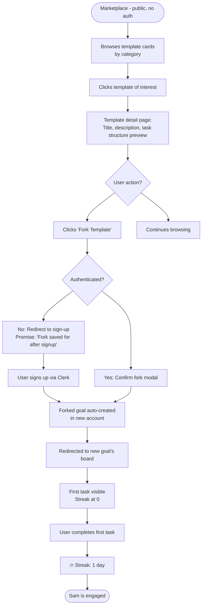
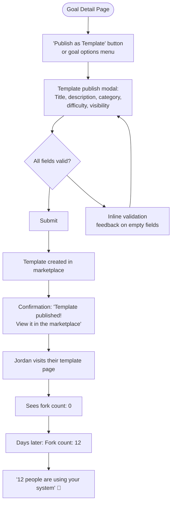

# UX Design Specification — Journey Tracker

**Author:** Alonsooteroseminario
**Date:** 2026-02-21
**Version:** 1.0 (BMAD Method v6 — Phase 2 Planning)
**Status:** Complete

---

## Executive Summary

### Project Vision

Journey Tracker is a personal goal achievement platform that closes the gap between ambitious goals and daily execution. From a UX perspective, the product must deliver three non-negotiable experiences: **momentum visibility** (users always know exactly how they're doing), **frictionless progress** (recording a win must take under 5 seconds), and **AI as a power tool** (not a gimmick). The visual and interaction design must make users feel like they are in control of their future — every screen should whisper "you're making progress."

The product is a brownfield Next.js 15 web application with Tailwind CSS already in use, Clerk authentication, and an embedded Claude-powered AI agent. UX decisions must work within and enhance the existing architecture rather than require a full redesign.

### Target Users

**Persona 1 — Alex, The Motivated Professional (Primary, ~60% of users)**
- Age 32, product manager / knowledge worker
- Sets big goals (promotion, fitness, side project) but loses momentum after 2–3 weeks
- Uses app daily for 3–5 minutes, mobile during commute, desktop at desk
- Primary motivator: streak continuity and peer accountability
- Needs: Fast status updates, streak visibility, social signal that others are moving too
- Pain point with existing tools: Progress tracking becomes a second job; apps are too complex

**Persona 2 — Jordan, The Template Creator (Secondary, ~20% of users)**
- Age 38, has completed several ambitious goals with a personal system
- Power user who wants to give back by publishing templates
- Desktop-primary, spends 20–40 minutes in sessions
- Primary motivator: Fork count — social proof that their system helps others
- Needs: Rich goal editor, template publishing UX, visibility into who forked their work

**Persona 3 — Sam, The Accountability Partner (Secondary, ~20% of users)**
- Joined through a friend link; social entry, not a goal-first entry
- Less intrinsically motivated; accountability is the hook
- Mobile-primary; engages primarily through the feed
- Primary motivator: Not wanting to fall behind their friend
- Needs: Frictionless onboarding, feed legibility, easy goal creation from template

### Key Design Challenges

1. **Empty State Problem** — New users face a blank dashboard with no goals and no streaks. The app's value is invisible until the user creates something. We must eliminate the blank slate anxiety immediately (AI chat prompt as first-screen CTA).

2. **Depth vs. Discoverability** — The Goal → Phase → Task → Substep hierarchy is powerful but potentially overwhelming. Kanban drill-down must feel like zooming in, not entering a different app.

3. **AI Onboarding vs. Traditional Form** — Two creation paths exist (AI chat and form UI). UX must ensure neither path feels inferior. The AI path must feel magical, not technical. The form path must feel empowering, not boring.

4. **Mobile-First in a Data-Rich App** — Streak counters, Kanban boards, feeds, and templates are all data-dense. Every screen must have a clear mobile-first layout without compromising desktop productivity.

5. **Streak Fragility = Emotional Risk** — Losing a streak is emotionally charged. The UX for streak reset must be empathetic and immediately offer a recovery path, not a shame moment.

### Design Opportunities

1. **Streak Counter as Identity** — The streak number is the app's emotional core. Design it as a badge of honor: animated flame, prominent placement, contextual motivational copy that scales with streak length. This is what users will screenshot and share.

2. **AI as Conversation, Not Form** — The chat widget is positioned bottom-right and available on all pages. Design the welcome prompt to be irresistible — a specific, actionable question that makes typing feel natural. The AI response should populate the Kanban board with visible, satisfying animation.

3. **Social Accountability Loop** — The feed is not a social network; it is a mirror. Users should see their friends' completions the moment they open the feed, creating instant social pressure/inspiration. Design feed cards to be emotionally resonant.

4. **Template as Social Currency** — Fork counts on published templates are the designer's metric. Make fork count visible and celebrated on the template card. A "12 people are using your system" message has high shareability.

---

## Core User Experience

### Defining Experience

The single defining experience of Journey Tracker is: **"Move a task to Done."**

Every design decision radiates from this core action:
- Opening the app → see your active goal's board immediately
- Seeing tasks in "In Progress" → drag one to "Done" (or tap the check)
- Streak counter increments → motivational message fires
- Session complete in under 60 seconds

This is the "Tinder swipe" of Journey Tracker. If we make this one interaction feel effortless, satisfying, and emotionally rewarding, everything else is secondary.

### Platform Strategy

**Primary:** Web application (desktop + mobile browser), responsive design
**Mobile viewport minimum:** 375px (iPhone SE modern)
**Desktop viewport:** 1280px+ optimized, max-width containers at 1200px
**Progressive Web App:** Not in scope for MVP (no offline mode)
**Touch-first for mobile:** Drag-and-drop on desktop; tap-to-complete on mobile (touch drag on mobile is secondary)

Platform is locked: Next.js 15 App Router, SSR/RSC with client islands. This means:
- Pages are initially server-rendered (fast first paint)
- Interactivity loads after hydration (no spinner hell — skeleton screens instead)
- No separate mobile app; mobile web is the mobile experience

### Effortless Interactions

These interactions must require zero cognitive load:

1. **Task completion** — Single tap/click on task checkbox or drag to "Done" column. No confirmation dialog. Optimistic update (instant visual change before API returns).

2. **AI chat entry** — Type and press Enter. No button needed. The input is always focused when the chat widget opens.

3. **Streak check** — Streak counter is visible on dashboard without scrolling. No navigation required to see your current streak.

4. **Feed glance** — Most recent friend activity visible without scrolling on mobile. Feed cards are compact (2–3 per mobile screen).

5. **Template fork** — One CTA button on template card. Fork → immediate goal creation → redirect to new goal's board.

### Critical Success Moments

1. **First goal created** — Within 5 minutes of sign-up. The empty dashboard AI prompt converts the user's anxiety into action. Success: Goal appears on the board with tasks visible.

2. **First streak** — Day 1 streak of "1" with celebratory animation. Streak counter must celebrate the very first day, not just milestones. The 🔥 flame icon must appear immediately.

3. **First social interaction** — Seeing a friend's activity in the feed for the first time. This moment should feel surprising and warm: "Oh, Jordan just completed a task!" Not a notification — a living proof of life.

4. **First task dragged to Done** — The Kanban drag event must be viscerally satisfying. Cards should snap into place with a subtle animation.

5. **Streak reset + recovery** — When a streak resets, the AI proactively offers a path forward. Success: user takes action and starts a new streak in the same session.

### Experience Principles

1. **Progress is sacred** — Every completed action must be acknowledged. No silent successes. But keep celebration proportionate (don't over-animate common actions).

2. **Mobile first, not mobile only** — Design every screen for 375px first, then enhance for wider viewports. Mobile-first is a constraint, not a limitation.

3. **One job per screen** — Each screen has one primary action. Secondary actions are available but not prominent. The Kanban board's primary action is moving tasks; the feed's primary action is reading.

4. **AI is always one step away** — The chat widget is available on all authenticated pages. Never more than one click to start an AI conversation.

5. **Transparency builds trust** — Activity feed diffs ("Changed title from X to Y") are honest. Streak calculations must feel trustworthy. No surprises in how data is displayed.

6. **Failure states are opportunities** — Empty states, errors, and streak resets are all opportunities to guide the user toward value. Never a dead end.

---

## Desired Emotional Response

### Primary Emotional Goals

**Primary:** **Momentum and agency** — Users should feel like they are moving forward. The app is a co-pilot, not a judge. After every session, users should feel accomplished, not anxious about what they haven't done.

**Secondary:** **Belonging** — Knowing friends are working on their goals creates a low-pressure form of social accountability. Not competitive — collaborative.

**Tertiary:** **Delight at precision** — The AI correctly parsing a vague goal into a structured plan should feel like magic. The streak counter's motivational copy should make users smile.

### Emotional Journey Mapping

| Stage | User Action | Desired Feeling | Design Vehicle |
|-------|-------------|-----------------|----------------|
| Discovery | Visiting landing page | Intrigue, optimism | Clear value prop, social proof |
| Sign-up | Clerk OAuth | Relief (it's fast) | Minimal steps, Google login first |
| Empty dashboard | AI prompt appears | Curiosity, safety | Warm, specific AI prompt |
| First goal created by AI | Goal populates | Delight, awe | Animated card creation |
| First task completed | Drag to Done | Satisfaction, pride | Snap animation + streak tick |
| Streak milestone | 7-day streak | Excitement, identity | Full-screen moment (7-day badge) |
| Streak reset | Return after miss | Vulnerability | Empathetic AI message, no shame |
| Feed view | Friend completed task | Warmth, mild pressure | "Jordan did it — your turn" energy |
| Template fork | Fork button clicked | Confidence | "Your plan is ready" confirmation |

### Micro-Emotions

**Confidence vs. Confusion:** Navigation must be self-evident. Users should never wonder where they are. Breadcrumbs in Kanban drill-down provide this.

**Trust vs. Skepticism:** Streaks must be trustworthy. If the app says "12-day streak," it must be exactly right. Timezone-aware calculation is the technical guarantee; clear streak history is the UX guarantee.

**Excitement vs. Anxiety:** New streaks should spark excitement. Large streak numbers (30+, 100+) should have special motivational text. Loss should be met with calm recovery, not punishment.

**Accomplishment vs. Frustration:** Task completion must be instant and visible. Optimistic updates eliminate the lag between action and reward.

**Delight vs. Satisfaction:** Aim for delight on first-time experiences (first goal, first streak, first friend) and satisfaction on repeat interactions (daily task completion).

### Design Implications

**Momentum:** Green as the primary accent color for completion states. Streak flame emoji (🔥) is prominently sized. Progress bars animate when they update.

**Belonging:** Feed cards include friend's profile image. Activity text is written in first person ("Jordan completed a task"). No likes or reactions (not a social network — an accountability mirror).

**Delight at precision:** AI response reveals goal structure with a typing-then-reveal animation. The structured plan appearing feels like a magic trick.

**Anxiety reduction:** Empty states always include a next action. Error states are written in plain language. Streak reset messaging emphasizes the fresh start, not the loss.

### Emotional Design Principles

1. **Celebrate proportionally** — 1-day streak gets a quiet ✅. 7-day gets a visual moment. 30-day gets a full announcement. 100+ gets a trophy.
2. **Write like a supportive friend** — All AI messages, empty states, and error messages use warm, direct language. No corporate copy.
3. **Failure is a plot twist, not an ending** — Streak reset copy: "Fresh start — let's go." Not "You broke your streak."
4. **Time-respect is a love language** — Every interaction is optimized for under 5 seconds. Power user sessions (template creation) are optimized for depth, not speed.

---

## UX Pattern Analysis & Inspiration

### Inspiring Products Analysis

**Duolingo (habit + streak + gamification)**
- Streak is identity: "568-day streak" is displayed as a trophy, not just a number. Users feel they ARE their streak.
- Milestone celebrations are disproportionately joyful. The owl dance for a 7-day streak is objectively absurd and universally beloved.
- Lesson: Streak number should be displayed with visual weight far beyond what a plain number warrants.
- Lesson: Milestone celebrations can be "too much" and that's fine — it becomes part of the product's personality.

**Linear (productivity + kanban + keyboard shortcuts)**
- Kanban drag-and-drop is buttery smooth. The card snaps into columns with near-zero visual jank.
- Status changes are instantaneous and never require confirmation (except delete).
- Keyboard-first design: `G+I` goes to issues, `C` creates. Power users never touch the mouse.
- Lesson: Optimistic updates and zero-latency visual feedback are non-negotiable for Kanban UX.
- Lesson: The board is the product — not a feature.

**Strava (social accountability + activity feed)**
- The feed is fundamentally about other people's effort, not their output. Seeing "Jordan ran 8km" triggers "I should do something today."
- Segments and KOM/QOM create achievement layers without requiring direct interaction.
- Activity cards are content-first: large athlete photo, activity stats front and center.
- Lesson: Social feed should surface effort and completion prominently. Numbers matter (tasks completed, streak length).
- Lesson: Feed interactions are optional (likes/comments) but feed reading is the primary behavior.

### Transferable UX Patterns

**Navigation Patterns:**
- **Bottom tab navigation (mobile)** from Strava/Linear — persistent bottom nav for core sections: Board, Feed, Marketplace, Profile. Chat widget is the floating action overlay.
- **Sidebar navigation (desktop)** from Linear — collapsible left sidebar with icon+label. Primary sections prominent; secondary sections (settings) at bottom.

**Interaction Patterns:**
- **Optimistic Kanban updates** from Linear — drag card → instant visual move → API call in background → revert only on error.
- **Streak-as-identity** from Duolingo — streak counter styled as a badge, not a metric. Positioned at top of dashboard, not buried in stats.
- **Activity feed as accountability mirror** from Strava — compact cards, friend's avatar prominent, action/completion context clear.

**Visual Patterns:**
- **Clean white + accent color** from Linear — white background, color accent for interactive states and completions. Not dark mode as default (productivity app, not entertainment).
- **Emoji-first icons** for goals and streaks — approachable, low-formality, personalizable. Goals use emoji for icon (🎯, 🏋️, 💻).
- **Progress bars with animation** — progress bar fills with smooth CSS transition on completion events.

### Anti-Patterns to Avoid

- **Notification overload (Notion)** — Avoid surfacing more than 2–3 "suggestions" on the dashboard. Cognitive load creep kills daily-use habits.
- **Stats buried in settings (Todoist)** — Streak and progress should be front-and-center, not requiring navigation to a separate stats page.
- **Complex modal flows for simple actions (Asana)** — Creating a task should require 1 input, not a modal with 8 fields. Advanced fields are progressive disclosure.
- **Competitive social pressure (Bereal)** — The feed should create warm accountability, not competitive anxiety. No leaderboards. No "you vs. friends" rankings.
- **Reward inflation (Habitica)** — Too many micro-rewards trivialize achievement. Celebrate milestones meaningfully; make daily completions feel good but not flashy.

### Design Inspiration Strategy

**Adopt:**
- Linear's Kanban drag-and-drop interaction model (buttery smooth, optimistic updates)
- Duolingo's streak-as-identity visual treatment (size, weight, emoji, milestone celebrations)
- Strava's activity feed structure (compact cards, avatar-first, action-context)
- Bottom tab navigation on mobile (universally understood for apps with 4–5 sections)

**Adapt:**
- Duolingo's streak celebration → proportional celebrations (not every day is a party, but every 7 days is)
- Linear's keyboard-first design → keyboard shortcuts for power users but not required for basic use
- Strava's social features → accountable without competitive (no rankings, no challenges)

**Avoid:**
- Over-gamification (points, badges beyond streak) in MVP
- Desktop-centric information architecture
- Hidden streak/progress behind navigation

---

## Design System Foundation

### Design System Choice

**Selected: Tailwind CSS (existing) + Headless UI / Radix UI primitives**

This is a brownfield project with Tailwind CSS already configured and in use across all components. The design system foundation is:

1. **Tailwind CSS v3** — Utility-first CSS for all styling (already installed, configured, used)
2. **Radix UI / Headless UI** — Accessible, unstyled interactive primitives (modals, dropdowns, tooltips) styled with Tailwind classes
3. **Custom Design Tokens** — Extended Tailwind config with Journey Tracker brand colors, spacing, and typography
4. **shadcn/ui-style component pattern** — Copy-owned components in `src/components/ui/` following the shadcn pattern (no black-box dependency)

This is categorized as **Themeable System**: maximum brand flexibility within a proven foundation, with full accessibility built into Radix UI primitives.

### Rationale for Selection

- **Zero migration cost** — Tailwind is already the only CSS framework in use. Switching would require rewriting every component.
- **Radix UI fills the accessibility gap** — Complex interactive components (Select, Dialog, Tooltip, DropdownMenu) are notoriously hard to make accessible from scratch. Radix provides ARIA-correct, keyboard-navigable primitives.
- **Developer velocity** — Tailwind classes in component JSX = no context switching between CSS files. One senior developer can move fast.
- **No design system lock-in** — Components are owned code (not node_modules UI). They can be modified without upstream constraints.
- **WCAG AA compatibility** — Radix UI primitives ship with correct ARIA attributes by default; color contrast is enforced via design tokens.

### Implementation Approach

1. **Extend Tailwind config** with Journey Tracker brand palette, custom spacing, and animation utilities (see Visual Foundation section)
2. **Create `src/components/ui/` base components** following shadcn pattern: `button.tsx`, `card.tsx`, `input.tsx`, `badge.tsx`, `dialog.tsx`, `dropdown-menu.tsx`, `progress.tsx`, `skeleton.tsx`, `toast.tsx`
3. **Install Radix UI primitives** as needed: `@radix-ui/react-dialog`, `@radix-ui/react-dropdown-menu`, `@radix-ui/react-tooltip`, `@radix-ui/react-select`
4. **@dnd-kit already installed** — Kanban drag-and-drop is already powered by @dnd-kit/core + @dnd-kit/sortable. Do not replace.

### Customization Strategy

- Brand color palette injected via Tailwind theme extension (CSS custom properties for dark mode readiness)
- Typography scale matched to NFR-006 (WCAG AA: minimum 16px body text, line-height ≥ 1.5)
- Component variants documented in a local `component-guide.md` file (not Storybook — scope is too large for MVP)
- Dark mode: Not in MVP scope. CSS custom properties architecture allows future addition without rewrite.

---

## 2. Core User Experience

### 2.1 Defining Experience

**"Move a task to Done."**

For Alex, the core action is dragging a task card from "In Progress" to "Done" on the Kanban board. For Sam (mobile), it is tapping the checkbox on a task. For Jordan (power user), it is creating a structured goal via the AI agent in one conversation.

All three paths converge on the same outcome: a task is marked complete, the streak increments, and the activity is logged to the feed.

This is established and confirmed by the PRD's core loop: Goal → Phases → Tasks → Substeps → Complete → Streak. The Kanban board is the center of the interaction universe.

### 2.2 User Mental Model

Users bring a **project management mental model** (Trello/Notion) blended with a **habit tracker mental model** (Streaks/Habitica). They expect:
- Cards that can be moved visually
- A history of what they've done (activity log)
- A number that goes up when they do things (streak)

They do NOT expect an AI agent on first contact. The AI must be introduced as an accelerator ("let me set this up for you") rather than a requirement.

**Current solution frustrations:**
- Notion: Too many options, no daily-use motivation
- Todoist: Great tasks, no goal hierarchy, no social accountability
- Notion + Habitica combo: Too many apps to maintain

**Mental model gaps to bridge:**
- "Phase" is not a universally understood term — use "Phase" consistently but provide tooltip/empty state explanation
- AI goal creation output needs to feel like something the user designed, not something the AI decided

### 2.3 Success Criteria

| Criteria | Measure |
|----------|---------|
| First goal created | Within 5 minutes of sign-up, via AI or form |
| First task completed | Within first session (board visible after goal creation) |
| Streak counter understood | User can identify their streak without instructions |
| AI creation success | AI-generated goal has correct structure without user editing |
| Feed legibility | User understands a friend's activity without explanation |

### 2.4 Novel UX Patterns

**AI-to-Kanban creation (novel):** The AI agent creates a full goal structure in one turn. The UX challenge: how does the user see the result of the AI's action? The board must show newly-created tasks with a subtle "just created" highlight (yellow border flash, 1.5s animation) so the user knows what changed.

**Timezone-aware streak (novel but invisible):** The streak is calculated correctly by design. The UX job is to make it trustworthy: display the streak history as a heatmap calendar (post-MVP), and clearly state "streak resets at midnight [User's Timezone]" in the tooltip on the streak counter.

**Feed diff rendering (novel):** Activity cards in the feed show before/after diffs for update events. This is unusual but creates authentic accountability. Design: show the diff in a subtle two-tone format ("Title: ~~Old~~ → New") without overwhelming the card.

### 2.5 Experience Mechanics

**Kanban Task Completion Flow:**

1. **Initiation:** User sees task card in "In Progress" column. Visual affordance: card has drag handle (⋮⋮) on hover (desktop), full card is tap target (mobile).
2. **Interaction (desktop):** User grabs card by drag handle, drags right to "Done" column. Smooth column highlight on hover-over.
3. **Interaction (mobile):** User taps task card → task detail sheet opens → taps "Mark Complete" button OR taps checkbox directly in task card list view.
4. **Feedback:** Optimistic update — card moves immediately. Streak counter increments (animated +1 with brief flash). Motivational text updates.
5. **Completion:** Card settles in "Done" column. Toast: "Task completed! 🔥 Streak: X days." RTK Query invalidates relevant tags; feed picks up the activity.

**AI Goal Creation Flow:**

1. **Initiation:** User opens chat widget (bottom-right FAB). Welcome prompt: "What goal have you been putting off? Tell me in one sentence and I'll build a plan."
2. **Interaction:** User types goal description. AI streams response showing it is "building the plan..." (progress skeleton)
3. **Feedback:** AI creates goal via MCP tools. Tool log shows compact "Created goal, 4 phases, 18 tasks" summary.
4. **Completion:** Board view updates (RTK Query cache invalidated). New goal cards appear with highlight animation. AI says: "Your plan is ready. First task: [Task 1 Title]. Want to start now?"

---

## Visual Design Foundation

### Color System

Journey Tracker uses a **warm, purposeful color system** built on an indigo-blue primary (professional, calm) with an amber-orange accent for streak/motivation moments (energy, momentum).

**Brand Palette (Tailwind extension):**

```js
// tailwind.config.js extension
colors: {
  brand: {
    50:  '#eef2ff',  // Lightest indigo — hover backgrounds
    100: '#e0e7ff',  // Light — selected states
    200: '#c7d2fe',  // Borders on focus
    500: '#6366f1',  // Primary interactive (buttons, links)
    600: '#4f46e5',  // Primary hover
    700: '#4338ca',  // Active/pressed
    900: '#1e1b4b',  // Nav sidebar background
  },
  streak: {
    50:  '#fff7ed',
    100: '#ffedd5',
    300: '#fdba74',  // Streak counter background
    400: '#fb923c',
    500: '#f97316',  // Flame accent
    600: '#ea580c',  // High streak milestone
  },
  success: '#16a34a',   // Task completed, streak active
  warning: '#d97706',   // Streak at risk
  error:   '#dc2626',   // Error states
  neutral: {
    50:  '#f9fafb',   // Page background
    100: '#f3f4f6',   // Card background
    200: '#e5e7eb',   // Borders, dividers
    400: '#9ca3af',   // Placeholder text
    600: '#4b5563',   // Secondary text
    900: '#111827',   // Primary text
  },
}
```

**Semantic Color Mapping:**

| Token | Color | Usage |
|-------|-------|-------|
| `primary` | brand-500 (#6366f1) | Primary buttons, links, active states |
| `primary-hover` | brand-600 (#4f46e5) | Button hover |
| `surface` | neutral-50 (#f9fafb) | Page/app background |
| `card` | white (#ffffff) | Card backgrounds |
| `border` | neutral-200 (#e5e7eb) | All borders, dividers |
| `text-primary` | neutral-900 (#111827) | Headings, primary content |
| `text-secondary` | neutral-600 (#4b5563) | Supporting text, labels |
| `text-muted` | neutral-400 (#9ca3af) | Placeholder, timestamp text |
| `streak-bg` | streak-100 (#ffedd5) | Streak counter background |
| `streak-icon` | streak-500 (#f97316) | Flame icon, streak number |
| `done` | success (#16a34a) | Done column header, completed checkboxes |
| `in-progress` | brand-500 (#6366f1) | In Progress column header |
| `todo` | neutral-400 (#9ca3af) | To Do column header |

**Contrast Ratios (WCAG AA compliance):**
- `neutral-900` on `white`: 16.1:1 ✓ (AAA)
- `brand-600` on `white`: 5.0:1 ✓ (AA)
- `neutral-600` on `white`: 7.0:1 ✓ (AAA)
- `text-primary` on `neutral-100`: 14.7:1 ✓ (AAA)
- All interactive elements: minimum 3:1 contrast for UI components ✓

### Typography System

**Font Stack (system fonts — no web font loading latency):**
```css
font-family: -apple-system, BlinkMacSystemFont, 'Segoe UI', 'Noto Sans', Helvetica, Arial, sans-serif;
```

**Type Scale:**

| Token | Size | Weight | Line Height | Usage |
|-------|------|--------|-------------|-------|
| `text-xs` | 12px | 400 | 1.5 | Timestamps, meta |
| `text-sm` | 14px | 400 | 1.5 | Labels, subtasks |
| `text-base` | 16px | 400 | 1.6 | Body text, descriptions |
| `text-lg` | 18px | 500 | 1.5 | Card titles |
| `text-xl` | 20px | 600 | 1.4 | Section headings |
| `text-2xl` | 24px | 700 | 1.3 | Page headings |
| `text-3xl` | 30px | 700 | 1.2 | Streak counter number |
| `text-4xl` | 36px | 800 | 1.1 | Landing page hero |

**Key Rules:**
- Minimum body text: 16px (prevents iOS auto-zoom on form inputs)
- Line height minimum 1.5 for body text (NFR-006)
- `font-weight: 600` for interactive labels (buttons, nav items)
- Streak number uses `text-3xl font-extrabold` — it must read at a glance

### Spacing & Layout Foundation

**Base unit: 4px (Tailwind default)**

**Spacing Scale in Use:**

| Token | px | Usage |
|-------|----|-------|
| `space-1` | 4px | Micro spacing (icon-text gap) |
| `space-2` | 8px | Element internal padding |
| `space-3` | 12px | Form input padding |
| `space-4` | 16px | Component padding, gutter |
| `space-6` | 24px | Card padding, section gap |
| `space-8` | 32px | Major section spacing |
| `space-12` | 48px | Page section spacing |
| `space-16` | 64px | Hero section spacing |

**Layout Grid:**
- **Mobile:** Single column, `px-4` page gutter (16px each side)
- **Tablet (768px+):** Single column with `px-6` gutter, optional sidebar
- **Desktop (1024px+):** `max-w-[1200px] mx-auto` container with sidebar (256px) + main content
- **Kanban board:** 3-column fixed grid on desktop; horizontal scroll with snap on mobile (320px card width each)

**Border Radius:**
- UI elements (buttons, badges): `rounded` (4px)
- Cards: `rounded-lg` (8px)
- Modals/sheets: `rounded-xl` (12px) or `rounded-t-xl` (mobile bottom sheet)
- Avatar/icon circles: `rounded-full`

**Shadows:**
- Cards: `shadow-sm` (subtle elevation — not flat, not dramatic)
- Modals/dropdowns: `shadow-lg` (clear layer separation)
- Active drag card: `shadow-2xl` (lifted effect during drag)

### Accessibility Considerations

All visual decisions are validated against WCAG 2.1 AA (NFR-006):

- **Color contrast:** All text/background pairs exceed 4.5:1 (verified above)
- **Focus indicators:** `focus-visible:ring-2 focus-visible:ring-brand-500 focus-visible:ring-offset-2` on all interactive elements
- **Touch targets:** Minimum 44×44px on mobile (buttons, checkboxes, nav items — all padded to meet this)
- **Reduced motion:** `@media (prefers-reduced-motion: reduce)` suppresses all animations; streak counter changes without animation
- **Text resize:** Rem-based sizing; all layouts tested at 200% browser zoom without horizontal overflow
- **Semantic HTML:** Enforced — headings follow H1→H2→H3 hierarchy; `<nav>`, `<main>`, `<aside>` landmark regions used

---

## Design Direction Decision

### Design Directions Explored

Based on the project context, tech stack (Tailwind CSS, Next.js 15), and the emotional design goals, the following direction archetypes were evaluated:

**Direction A — Clean Productivity (adopted)**
White background, indigo-blue primary accent, card-based content, system font stack. Similar to Linear's aesthetic. Maximizes legibility and professional feel. Appropriate for knowledge workers (Alex) as primary audience.

**Direction B — Gamified Dark Mode**
Dark background, vibrant streaks/achievements, high-contrast UI. More like Duolingo. Rejected: Dark mode is out of MVP scope. Gamification depth would require significant design system work.

**Direction C — Warm Beige/Organic**
Warm neutral palette, humanistic typography. Rejected: Too soft for a productivity tool. Streak counter needs energy, not calm.

**Direction D — Bold/High-Contrast**
Large type, strong color blocks, assertive CTA buttons. Considered for landing page only. Too aggressive for daily-use app screens.

### Chosen Direction

**Direction A — Clean Productivity, enhanced with Amber Streak Accents.**

The core UI uses white backgrounds and indigo-blue as primary interactive color (clean, professional, trustworthy). Streak-related UI elements — the counter, milestone badges, the 🔥 icon — use the amber-orange streak palette to create warm energy contrast within the clean foundation. This creates a natural visual hierarchy: most of the UI is calm and productive; streak/achievement moments pop with color.

### Design Rationale

- **Matches user context:** Alex uses this at work, during commute. Clean and professional doesn't cause "gamer app" embarrassment.
- **Amber streak creates identity:** The streak counter's orange-amber color is distinctive. It becomes the brand's signature element.
- **Consistency with existing code:** The codebase already uses Tailwind utility classes throughout. Direction A requires zero CSS architecture changes.
- **Scalable to future dark mode:** White-primary with CSS custom properties sets up dark mode tokens without rewrite.

### Implementation Approach

1. Extend `tailwind.config.js` with the brand palette (defined in Visual Foundation)
2. Define CSS custom properties in `src/app/globals.css` for semantic tokens
3. Update existing component class names to use semantic tokens where direct color classes exist
4. Apply streak color palette exclusively to streak-related components (StreakCounter, milestone badges, 🔥 icons)

---

## User Journey Flows

### Journey 1: First Goal Creation (AI Path)

**Entry:** User signs up and lands on empty dashboard.

**Flow:**


**Optimizations:**
- AI widget auto-opens on empty dashboard (first login only, dismissed on first interaction)
- "Start Now" button appears in AI response — no navigation required
- Streak counter visible without scrolling immediately after first task completion

### Journey 2: Daily Check-in (Retention)

**Entry:** Returning user opens app (direct URL or bookmark).

**Flow:**


**Optimizations:**
- Active goal shown first on dashboard (most recently accessed goal)
- Streak counter persistent in top nav on desktop; bottom of stats card on mobile
- Feed link in bottom nav shows badge with unread count

### Journey 3: Streak Recovery After Miss

**Entry:** User missed yesterday. Opens app. Streak = 0.

**Flow:**


**Emotional design note:** No red UI, no exclamation marks of alarm. Streak reset is shown with neutral styling. The 🔥 icon is simply absent (not replaced by a ❌ or 💔). AI message is warm and forward-looking.

### Journey 4: Template Discovery & Fork

**Entry:** New user invited by friend (Sam's journey). Lands on public marketplace.

**Flow:**


**Optimizations:**
- Template cards show fork count prominently (social proof)
- Task structure preview on template detail (accordion of phases/tasks, collapsed by default)
- "Fork saved for after signup" — store templateId in session; apply on first Prisma user creation

### Journey 5: Template Publishing (Jordan)

**Entry:** Jordan has an existing goal and wants to publish it as a template.

**Flow:**


### Journey Patterns

**Navigation pattern:** All core journeys use the same navigation structure. Users always know where they are because the active nav item is highlighted and page headings are consistent.

**Confirmation pattern:** Destructive actions (delete goal, remove friend) use a confirmation modal with a clear warning and "Cancel" as the visually primary button. Non-destructive actions (complete task, publish template) use toast-only confirmation (no modal).

**Error recovery pattern:** API failures trigger a toast error + optimistic update revert. The error message includes a "Try again" action inline. Never a blank screen on error.

**Empty state pattern:** Every list view has a purpose-built empty state with:
1. Illustrative icon (emoji or SVG)
2. Plain-language explanation ("No goals yet")
3. Primary CTA ("Create your first goal" or "Browse templates")

### Flow Optimization Principles

1. **Eliminate confirmation dialogs for reversible actions** — Task completion, Kanban moves, friend accept: immediate action, undo via toast (5 second window).
2. **AI responses should end with a next action** — Every AI response closes with a specific, clickable "What's next?" suggestion.
3. **Mobile bottom sheet over modal** — On mobile (< 768px), context actions appear as bottom sheets (slide up from bottom) instead of centered modals. Respects thumb zone.
4. **Progressive disclosure for advanced fields** — Goal creation form: Title first, then "Add details" expander for description, target date, budget, icon. Most users only need the title.

---

## Component Strategy

### Design System Components

Tailwind CSS provides base utilities. Radix UI provides accessible primitives. The following Radix UI primitives are required:

| Radix Component | Used For | ARIA Benefit |
|----------------|----------|-------------|
| `@radix-ui/react-dialog` | Goal create/edit modal, template publish | `role="dialog"`, focus trap, Escape key |
| `@radix-ui/react-dropdown-menu` | Goal options menu (⋮), user account menu | `role="menu"`, keyboard navigation |
| `@radix-ui/react-select` | Timezone picker, category select, priority | `role="combobox"`, keyboard search |
| `@radix-ui/react-tooltip` | Streak counter detail, button explanations | `role="tooltip"`, hover+focus trigger |
| `@radix-ui/react-toast` | Success/error notifications | `role="status"`, `aria-live="polite"` |
| `@radix-ui/react-progress` | Goal progress bar | `role="progressbar"`, `aria-valuenow` |
| `@radix-ui/react-avatar` | User/friend profile images | `alt` text fallback to initials |
| `@radix-ui/react-tabs` | Feed filter tabs (All/Friends/Goals) | `role="tablist"`, keyboard arrows |

### Custom Components

These components are unique to Journey Tracker and must be built custom (not available in Radix/standard libraries):

#### StreakCounter Component

**Purpose:** Displays current streak with flame icon, number, and motivational copy.
**Anatomy:**
- 🔥 flame icon (24px, `streak-500` color)
- Streak number (`text-3xl font-extrabold`, `streak-500` color)
- "day streak" label (`text-sm text-secondary`)
- Motivational text line (changes at 1, 7, 30, 100, 365 days)
- Tooltip: "Resets at midnight [Timezone]" (Radix Tooltip)

**States:**
- `active` (streak > 0): amber background chip, full display
- `broken` (streak = 0): neutral styling, "Start your streak today" CTA
- `loading`: skeleton shimmer

**Accessibility:** `aria-label="Current streak: {n} days"` on the wrapper element.

#### KanbanBoard Component

**Purpose:** Three-column task board (To Do / In Progress / Done) with drag-and-drop.
**Anatomy:**
- Column header (title + task count badge + accent color bar)
- Task card list (DndContext + SortableContext from @dnd-kit)
- "Add task" input at bottom of each column
- Drop zone highlight when card is being dragged over column

**States per card:**
- `default`: white background, subtle shadow
- `dragging`: elevated shadow (`shadow-2xl`), slight scale transform (1.02)
- `completed`: Done column cards show strikethrough title + green left border
- `priority:high`: Red left border indicator

**Mobile behavior:** Horizontal scroll with column snap. Each column is 320px wide. No drag-and-drop on mobile (replaced by tap → status selector sheet).

**Accessibility:** `role="list"` on columns, `role="listitem"` on cards, `aria-grabbed` on active drag state. Keyboard: Tab to card, Enter to open card detail, keyboard shortcut guide in column header.

#### ActivityFeedCard Component

**Purpose:** Displays a single friend activity item in the feed.
**Anatomy:**
- Friend avatar (32px, `rounded-full`, initials fallback)
- Friend name + action text (e.g., "Jordan completed a task")
- Goal name as secondary text
- Diff rendering (if update event): `~~old~~` → `new` styled inline
- Timestamp (relative: "2 hours ago")
- Goal emoji icon (16px, right-aligned)

**States:**
- `new` (unseen): light brand-50 background, fades to white after 3 seconds
- `default`: white background
- `diff`: monospace diff text for update events

**Accessibility:** Full card is readable by screen reader as a sentence. Diff is rendered with `aria-label` explaining the change.

#### ChatWidget Component (existing, refine)

**Purpose:** Embedded AI chat interface, persistent across all authenticated pages.
**Anatomy:**
- Floating action button (FAB, bottom-right, 56×56px, brand-500 background)
- Expanded panel (400px wide, 560px tall on desktop; full-screen bottom sheet on mobile)
- Message list (Claude messages + user messages + tool log entries)
- Input bar (textarea, auto-grow, max 4 rows, Enter to send)
- Close button (X) in panel header

**States:**
- `collapsed`: FAB only, badge shows if there are unread AI messages
- `expanded`: Full chat panel visible
- `streaming`: Typing indicator (3-dot bounce) while AI is responding
- `tool-executing`: Compact tool log entry below AI message ("Created goal, 4 phases")

**Accessibility:** `role="complementary"`, `aria-label="AI Assistant"`. Focus moves to input when expanded. Escape key collapses panel. `aria-live="polite"` on message list.

#### TemplateCard Component

**Purpose:** Displays a template in the marketplace grid.
**Anatomy:**
- Category badge (top-left, semantic color)
- Goal title (H3, 2 lines max, truncated)
- Author name + avatar (small, row)
- Fork count with fork icon ("🍴 12 forks")
- Difficulty badge (Beginner/Intermediate/Advanced)
- "Fork Template" CTA button (primary, full-width at bottom)

**States:**
- `default`: card with hover shadow elevation
- `hover`: shadow elevation increase, CTA button becomes visible
- `loading`: skeleton shimmer (title, author, fork count placeholders)

**Accessibility:** Entire card is a link with `aria-label="Fork [Template Title] by [Author]"`. Button inside link is a separate actionable element with `role="button"` preventing nested interactive elements issue via `stopPropagation`.

#### MobileStatsFAB Component (post-MVP)

**Purpose:** Floating action button on mobile that reveals stats bottom sheet.
**Anatomy:**
- FAB (48×48px, bottom-center on mobile, hidden on desktop)
- Bottom sheet: Streak counter, goal progress bars, recent activity count
- Sheet handle (drag up indicator)

**States:**
- `collapsed`: FAB visible
- `expanded`: Bottom sheet slides up, backdrop overlay, dismissible

### Component Implementation Strategy

**Foundation layer (Radix UI + Tailwind):** Install and configure Radix UI primitives. Create base `src/components/ui/` components (button, input, card, badge, dialog, etc.) following shadcn patterns.

**Domain layer (custom Journey Tracker components):** Build `StreakCounter`, `KanbanBoard`, `ActivityFeedCard`, `ChatWidget` (refine existing), `TemplateCard`. Each has full state coverage and accessibility annotations.

**Page assembly layer:** Page components in `src/app/` assemble domain components using layout primitives.

### Implementation Roadmap

**Phase 1 — Foundation (Sprint 1):**
- Radix UI primitive components (`ui/button`, `ui/card`, `ui/input`, `ui/dialog`, `ui/toast`)
- StreakCounter (core identity component)
- KanbanBoard drag-and-drop refinement (existing, improve mobile)
- ActivityFeedCard

**Phase 2 — Supporting (Sprint 2–3):**
- TemplateCard with fork count
- ChatWidget panel refinement (mobile bottom sheet mode)
- Empty state components for all list views

**Phase 3 — Enhancement (Sprint 4):**
- MobileStatsFAB + bottom sheet (post-MVP story)
- Activity calendar heatmap
- Milestone celebration animations (confetti on 7-day, 30-day, 100-day streak)

---

## UX Consistency Patterns

### Button Hierarchy

Journey Tracker uses a 4-level button hierarchy:

**Primary (filled, `brand-500` background):**
- Usage: Single primary action per screen or modal. "Create Goal", "Fork Template", "Publish Template", "Send" (chat)
- Style: `bg-brand-500 hover:bg-brand-600 text-white font-semibold px-4 py-2 rounded focus-visible:ring-2`
- Only one per view context

**Secondary (outlined):**
- Usage: Supporting actions. "Edit", "Add Task", "View Template"
- Style: `border border-brand-500 text-brand-600 hover:bg-brand-50 font-medium px-4 py-2 rounded`

**Ghost (text-only):**
- Usage: Low-priority actions. "Cancel", "Dismiss", "Skip"
- Style: `text-neutral-600 hover:text-neutral-900 hover:bg-neutral-100 px-3 py-2 rounded`

**Destructive (red, used sparingly):**
- Usage: "Delete Goal", "Remove Friend". Always in confirmation context.
- Style: `bg-error text-white hover:bg-red-700` or `border border-error text-error hover:bg-red-50`

**Rules:**
- Primary button: Maximum 1 per modal, 1 per page section
- Destructive button: Never as a default action; always requires confirmation
- Icon-only buttons: Always include `aria-label`; tooltip on hover showing label

### Feedback Patterns

**Toast notifications (all async operations):**
- Success: Green left border, checkmark icon, "Task completed" — auto-dismiss 4 seconds
- Error: Red left border, warning icon, plain-language message + "Try again" action — auto-dismiss 8 seconds
- Info: Blue left border, info icon — auto-dismiss 5 seconds
- Position: Bottom-right on desktop, bottom-center on mobile (above thumb zone)
- Maximum 3 toasts visible simultaneously; queue excess

**Inline validation (forms):**
- Validation fires on blur (leaving the field), not on keydown
- Error message appears below the field in `text-error text-sm`
- Field border changes to `border-error` on invalid state
- Success state: checkmark icon appears inside field on valid

**Loading states:**
- Skeleton screens (not spinners) for initial page/list load
- Inline spinner (16px, brand-500) inside buttons during async action
- Button text changes: "Create Goal" → "Creating..." during submit
- Kanban optimistic updates: instant visual change, no loading indicator (fast enough)

**Empty states:**
Every empty list/collection has:
1. Centered emoji or SVG illustration
2. `text-xl font-semibold` heading ("No goals yet")
3. `text-secondary` description sentence
4. Primary CTA button

Examples:
- Empty goals: "No goals yet. Create your first goal or browse templates."
- Empty feed: "No friend activity yet. Add a friend to see their progress."
- Empty marketplace: "No templates in this category yet. Be the first to publish one."

### Form Patterns

**Input field anatomy:**
- Label above field (never placeholder-as-label)
- Input: `border border-neutral-200 rounded px-3 py-2 text-base focus:border-brand-500 focus:ring-2`
- Help text below (if needed): `text-sm text-secondary`
- Error text below (on invalid): `text-sm text-error`
- Required fields: `*` after label (not `required` text in placeholder)

**Textarea:** Same as input. Auto-resize via JS (chat input) or fixed height with scroll (description fields).

**Select/Dropdown:** Use Radix Select for all dropdowns (timezone, category, priority, difficulty). Native `<select>` only for non-critical secondary selections.

**Form layout:**
- Mobile: Full-width, single column, stacked labels
- Desktop modal: Single column with 400–500px max width
- Progressive disclosure: Show minimal fields by default; "Add details" expander reveals optional fields

**Validation summary:** Long forms (template publish) show a summary of all errors at the top of the form after submit attempt.

### Navigation Patterns

**Desktop sidebar navigation:**
```
┌────────────────────────────────────────┐
│ [🎯 Journey Tracker] [User Avatar]     │ ← Top bar (64px)
├──────────┬─────────────────────────────┤
│ 📋 Board │                             │
│ 📡 Feed  │   Main content area         │
│ 🏪 Market│                             │
│ 👤 Profile│                            │
│          │                             │
│          │                             │
├──────────┴─────────────────────────────┤
│ [Chat Widget FAB — bottom right]       │
└────────────────────────────────────────┘
```

**Mobile bottom navigation:**
```
┌─────────────────────┐
│   Main content      │
│   area              │
│                     │
├─────────────────────┤
│ 📋  📡  🏪  👤     │ ← Bottom nav (56px)
└─────────────────────┘
                    [🤖 Chat FAB — bottom-right, above nav]
```

**Active state:** Nav item has `brand-500` color icon + label, `brand-50` background pill.

**Breadcrumb (Kanban drill-down):**
`Board > [Goal Title] > [Task Title]`
Each segment is a link. Current page is not linked. Mobile: Collapsed to `< [Parent]` back arrow.

**Page headings:** Every page has a visible H1. On the board, the H1 is the selected goal name.

### Additional Patterns

**Modal/Dialog patterns:**
- Max width: 560px on desktop, full-screen on mobile (bottom sheet)
- Focus trap active while open (Radix Dialog handles this)
- Close via: X button, Escape key, clicking backdrop
- Backdrop: `bg-black/60` overlay
- Never stack more than 2 modals

**Bottom sheet (mobile):**
- Slide up from bottom with spring animation
- Handle bar at top center (visible drag indicator)
- Max height: 90vh; scrollable content inside
- Dismiss: swipe down, tap backdrop, or Escape

**Kanban column status colors:**
- To Do: `text-neutral-500` header
- In Progress: `text-brand-500` header, subtle left border
- Done: `text-success` header, subtle background tint

**Priority badges (task cards):**
- High: `bg-red-100 text-red-700` badge
- Medium: `bg-amber-100 text-amber-700` badge
- Low: `bg-green-100 text-green-700` badge
- None: No badge shown

**Streak motivational copy bank (by range):**

| Range | Copy |
|-------|------|
| 1 | "Day one. The hardest step is done." |
| 2–6 | "Keep the momentum going. 🔥" |
| 7 | "One week strong! This is becoming a habit. 🏆" |
| 8–29 | "You're on fire. Don't stop now. 🔥" |
| 30 | "A whole month! You're unstoppable. 🎉" |
| 31–99 | "Legendary consistency. The compound effect is real." |
| 100 | "100 days! You are the 1%. 🏅" |
| 100+ | "Built different. Nothing can stop you now. 💪" |

---

## Responsive Design & Accessibility

### Responsive Strategy

**Philosophy: Mobile First**
Every component is designed starting at 375px wide. Tablet and desktop layouts are progressive enhancements, not afterthoughts.

**Mobile (375px – 767px):**
- Single-column layout
- Bottom tab navigation (56px tall, fixed)
- Chat widget: Full-screen bottom sheet when opened
- Kanban board: Horizontal scroll (320px columns, scroll-snap)
- Modals: Full-screen bottom sheets
- Task cards: Tap for detail sheet (no drag-and-drop)
- No sidebar; all navigation via bottom tabs

**Tablet (768px – 1023px):**
- Single-column layout with increased gutter (`px-8`)
- Bottom tab navigation or collapsible sidebar (auto-collapsed by default)
- Kanban board: Horizontal scroll with larger columns (360px)
- Modals: Centered with max-width 540px, not full-screen
- Chat widget: Side panel (50% width)

**Desktop (1024px+):**
- Two-column layout: 256px fixed sidebar + flexible main content
- Top bar with logo + user avatar (sidebar nav replaces bottom tabs)
- Kanban board: Three fixed columns, full-width within main content
- Modals: Centered, max-width 560px, with backdrop
- Chat widget: 400px panel, bottom-right, above all content

### Breakpoint Strategy

Using Tailwind's default breakpoints (mobile-first):

| Breakpoint | Min Width | Layout Change |
|------------|-----------|---------------|
| `sm` | 640px | Minor padding adjustments |
| `md` | 768px | Tablet: side panels become available |
| `lg` | 1024px | Desktop: sidebar appears, bottom nav hidden |
| `xl` | 1280px | Max content width locked, extra whitespace |

**Custom breakpoint for Kanban:** `@media (max-width: 767px)` — horizontal scroll mode activated.

**CSS media query approach:**
```css
/* Mobile base (no prefix) → sm → md → lg pattern */
<div className="px-4 md:px-6 lg:px-8">        /* Responsive gutter */
<nav className="fixed bottom-0 lg:hidden">     /* Bottom nav: mobile only */
<aside className="hidden lg:flex">             /* Sidebar: desktop only */
```

### Accessibility Strategy

**Target:** WCAG 2.1 Level AA (NFR-006) — industry standard, legally compliant in most jurisdictions.

**Core Requirements:**

| Criterion | Implementation |
|-----------|---------------|
| 1.1.1 Non-text Content | All images have `alt` text; icon-only buttons have `aria-label` |
| 1.4.1 Use of Color | Information never conveyed by color alone (badges have text, not just color) |
| 1.4.3 Contrast (Min) | All text meets 4.5:1 ratio (verified in color system) |
| 1.4.4 Resize Text | rem-based sizing; layouts work at 200% zoom |
| 1.4.11 Non-text Contrast | UI components and focus indicators meet 3:1 ratio |
| 2.1.1 Keyboard | All interactive elements operable via keyboard; no keyboard traps |
| 2.1.2 No Keyboard Trap | Radix UI primitives handle focus trapping in modals correctly |
| 2.4.3 Focus Order | Logical tab order follows visual layout |
| 2.4.4 Link Purpose | All links/buttons have descriptive labels (not "click here") |
| 2.4.6 Headings and Labels | Page H1s, section H2s, component H3s in correct hierarchy |
| 2.4.7 Focus Visible | `focus-visible:ring-2 ring-brand-500 ring-offset-2` on all interactive elements |
| 3.1.1 Language of Page | `lang="en"` on `<html>` |
| 3.3.1 Error Identification | Form errors: field-level, plain language, role="alert" |
| 4.1.2 Name, Role, Value | Radix UI components provide correct ARIA; custom components annotated |

**Keyboard Navigation Map:**

| Key | Behavior |
|-----|----------|
| `Tab` | Move to next focusable element |
| `Shift+Tab` | Move to previous focusable element |
| `Enter` / `Space` | Activate button or link |
| `Arrow Keys` | Navigate within Kanban columns; navigate tabs |
| `Escape` | Close modal, bottom sheet, or dropdown |
| `?` | (Power user) Open keyboard shortcut reference |

**Screen Reader Annotations:**

- Kanban board: `aria-label="Task board for [Goal Name]"`. Columns: `role="list"` with `aria-label="To Do tasks"`. Cards: `role="listitem"`.
- Streak counter: `aria-label="Current streak: 12 days. Resets at midnight EST."`
- Chat widget FAB: `aria-label="Open AI assistant"`. Chat panel: `role="dialog"` with `aria-label="AI Assistant"`.
- Activity feed: `aria-live="polite"` on feed list container for real-time additions.
- Progress bar: Radix Progress with `aria-valuenow`, `aria-valuemin="0"`, `aria-valuemax="100"`.
- Dynamic content (toast): `role="status"` or `aria-live="polite"`.

**Drag and Drop Accessibility:**
@dnd-kit provides keyboard drag-and-drop support. Users can:
- Focus a card (Tab to it)
- Press `Space` to "pick up" the card
- Press `Arrow Keys` to move it
- Press `Space` again to drop it
- Press `Escape` to cancel

The Kanban task cards on mobile use the tap-to-status-selector pattern instead of drag, which is more accessible on touch devices.

### Testing Strategy

**Responsive Testing:**
- Automated: Playwright viewport testing at 375px, 768px, 1280px for all critical flows
- Manual: iPhone SE (375px), iPad (768px), MacBook (1440px) — monthly regression
- Browser matrix: Chrome, Firefox, Safari, Edge (current versions)
- Performance: Lighthouse mobile score target ≥ 85 (First Contentful Paint < 1.5s on 3G)

**Accessibility Testing:**
- Automated: `axe-core` integrated into Playwright E2E tests (`@axe-core/playwright`)
- Manual: VoiceOver on macOS/iOS (Safari), NVDA on Windows (Chrome) — quarterly
- Keyboard-only navigation: Manual test of all critical flows using keyboard exclusively
- Color blindness: Contrast checker + colorblindness simulator for primary UI states
- CI gate: Accessibility test failures block merges to main (via Playwright E2E)

**User Testing:**
- Moderated testing sessions with 3-5 users per sprint (informal, internal early adopters)
- Specific accessibility test: Invite 1 screen reader user per major release cycle
- A/B variants not in scope for MVP

### Implementation Guidelines

**Responsive Development:**
- Use Tailwind responsive prefixes (`sm:`, `md:`, `lg:`) — never custom media queries unless necessary
- Relative units for font sizes (`rem`), spacing (`rem`/`%`), container widths (`%`, `vw`, `max-w-*`)
- Fixed `px` values only for borders (1px, 2px) and shadows
- Images: Use `next/image` with `layout="responsive"` or explicit `width`/`height` + `sizes` prop
- Viewport-sensitive components (bottom nav, sidebar) use `lg:hidden` / `hidden lg:flex` pattern

**Accessibility Development:**
- Prefer semantic HTML over ARIA (`<button>` over `<div role="button">`)
- Radix UI primitives for all complex interactive components — never rebuild from scratch
- Custom components must pass `axe-core` audit before PR merge
- Icon-only buttons: always `<button aria-label="Delete goal"><TrashIcon aria-hidden="true" /></button>`
- Form inputs: always `<label htmlFor="inputId">` + `<input id="inputId">` — never `aria-label` on input without visible label
- Error messages: `role="alert"` or `aria-describedby` linking input to error paragraph
- Skip navigation link: `<a href="#main-content" className="sr-only focus:not-sr-only">Skip to main content</a>` in `<body>` before nav

---

## Workflow Completion

**Date Completed:** 2026-02-21
**Steps Completed:** 1–14 (all steps)
**Status:** Complete — ready for implementation

### What Was Accomplished

- ✅ Project understanding and user insights (3 personas, 5 user journeys)
- ✅ Core experience definition ("Move a task to Done")
- ✅ Emotional response design (momentum, belonging, delight at precision)
- ✅ UX pattern analysis (Duolingo streaks, Linear Kanban, Strava feed)
- ✅ Design system choice (Tailwind CSS + Radix UI — brownfield-compatible)
- ✅ Core interaction mechanics (Kanban drag-and-drop flow, AI creation flow)
- ✅ Visual design foundation (indigo-blue primary, amber streak accent, system fonts)
- ✅ Design direction (Clean Productivity + Amber Streak Accents)
- ✅ User journey flows (5 journeys with Mermaid diagrams)
- ✅ Component strategy (8 Radix UI primitives + 5 custom Journey Tracker components)
- ✅ UX consistency patterns (buttons, feedback, forms, navigation, Kanban, streaks)
- ✅ Responsive design (mobile-first, 3 breakpoints)
- ✅ Accessibility strategy (WCAG 2.1 AA, full keyboard navigation, screen reader annotations)

### Design Deliverables Summary

| Deliverable | Location |
|-------------|----------|
| UX Design Specification | `_bmad-output/planning-artifacts/ux-design-specification.md` (this file) |
| PRD (requirements source) | `_bmad-output/planning-artifacts/prd.md` |
| Epics & Stories | `_bmad-output/planning-artifacts/epics.md` |
| Architecture | `docs/architecture-journey-tracker-2026-02-20.md` |
| Sprint Plan | `docs/sprint-plan-journey-tracker-2026-02-20.md` |

### Recommended Next Steps

**For technical teams (current path):**

1. **Review with Product Manager** — Validate UX decisions against PRD requirements coverage
2. **Begin implementation with STORY-001** — Activity logging system is the foundation; UX patterns apply immediately
3. **Implement design tokens first** — Extend `tailwind.config.js` with brand palette before any visual work
4. **Build base component layer** — `src/components/ui/` Radix-based components before domain components
5. **Run /dev-story** for each story in sprint order

**Design system implementation order:**
1. Tailwind config extension (colors, spacing)
2. Base UI components (button, card, input, dialog)
3. StreakCounter (highest emotional priority)
4. KanbanBoard drag-and-drop refinement
5. ActivityFeedCard
6. ChatWidget mobile bottom sheet mode
7. TemplateCard
8. Empty states for all views
9. MobileStatsFAB (Sprint 3)

---

*Generated by BMAD Method v6 — UX Designer Agent*
*Date: 2026-02-21*
*Steps completed: 2, 3, 4, 5, 6, 7, 8, 9, 10, 11, 12, 13, 14*
