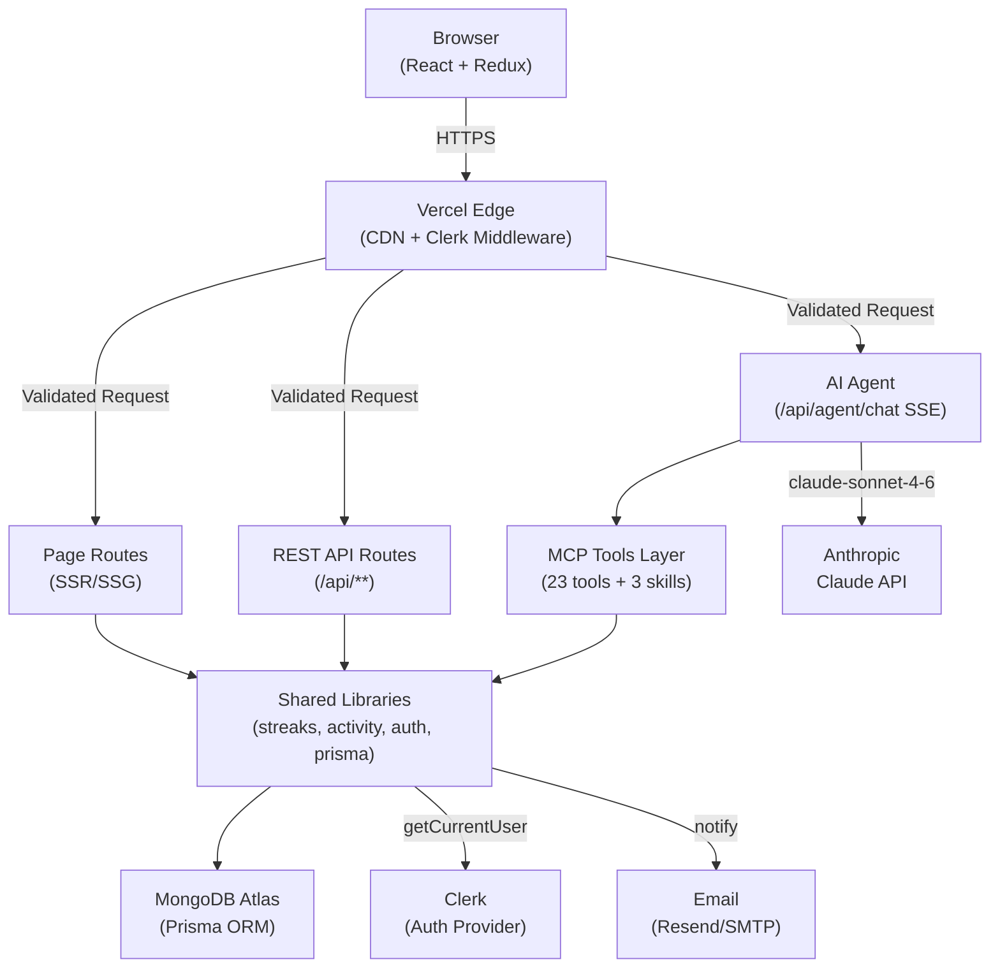

# System Architecture: Journey Tracker

**Date:** 2026-02-20
**Architect:** Alonsooteroseminario
**Version:** 1.0
**Project Type:** web-app
**Project Level:** 4 (Enterprise)
**Status:** Draft

---

## Document Overview

This document defines the system architecture for Journey Tracker. It provides the technical blueprint for implementation, addressing all 50 functional requirements and 10 non-functional requirements from the PRD.

**Related Documents:**
- Product Requirements Document: `docs/prd-journey-tracker-2026-02-20.md`
- Product Brief: `_bmad-output/planning-artifacts/product-brief-journey-tracker-2026-02-20.md`

---

## Executive Summary

Journey Tracker is built as a **Serverless Full-Stack Monolith** on Vercel, using Next.js 15 App Router as both the frontend framework and API layer. This architecture is deliberately chosen over microservices: it eliminates operational overhead, enables rapid iteration with a single developer, and leverages Next.js's built-in server/client component boundaries for clean separation of concerns.

The system has three runtime environments: the Vercel Edge Network (static assets + CDN), Vercel Serverless Functions (API routes + SSR), and MongoDB Atlas (persistent data). An embedded Claude-powered AI agent runs as a long-lived SSE streaming function within the same Next.js API layer.

Key architectural decisions:
- **No separate backend service**: Next.js API routes serve all REST endpoints and the AI agent
- **Prisma as the single ORM**: All database access goes through Prisma — no raw MongoDB queries
- **Redux Toolkit + RTK Query**: All client state and data fetching is centralized in Redux
- **Clerk for all auth**: No custom auth code — Clerk middleware handles session validation everywhere
- **Shared utility pattern**: Critical business logic (streaks, activity tracking) is in single shared libraries called from all mutation paths

---

## Architectural Drivers

The following NFRs most heavily influence architectural decisions:

1. **NFR-001: API Response < 300ms (P95)** → Drives: efficient Prisma queries, selective data fetching, RTK Query caching
2. **NFR-002: Auth + Ownership Verification on All Routes** → Drives: Clerk middleware at the edge, per-tool ownership checks in MCP layer
3. **NFR-004: 99.5% Uptime** → Drives: Vercel platform (zero-downtime deploys), MongoDB Atlas with auto-failover
4. **NFR-005: Fully Responsive at 375px** → Drives: Mobile-first Tailwind design, separate mobile components (FAB/bottom-sheet)
5. **NFR-007: AI Agent Rate Limiting + 120s Timeout** → Drives: SSE streaming architecture, max-iterations guard, context trimming
6. **NFR-008: ≥80% Test Coverage on Business Logic** → Drives: Vitest collocated tests, all MCP tools must have test files
7. **NFR-003: 10,000 Concurrent Users** → Drives: Vercel auto-scaling, stateless serverless functions, MongoDB Atlas M10+

---

## System Overview

### High-Level Architecture

```
┌─────────────────────────────────────────────────────────────────────┐
│                        Client Browser                               │
│  React 18 + Redux Toolkit + RTK Query + Tailwind CSS               │
│  (Next.js App Router — Client Components)                           │
└──────────────────────────────┬──────────────────────────────────────┘
                               │ HTTPS / SSE
┌──────────────────────────────▼──────────────────────────────────────┐
│                    Vercel Edge Network                              │
│  Static Assets + CDN + Clerk Auth Middleware (Edge Runtime)        │
└──────────────────────────────┬──────────────────────────────────────┘
                               │ Forwarded Request
┌──────────────────────────────▼──────────────────────────────────────┐
│              Next.js 15 App Router (Serverless Functions)           │
│                                                                     │
│  ┌──────────────┐  ┌─────────────────┐  ┌──────────────────────┐  │
│  │  Page Routes │  │   API Routes    │  │   AI Agent Route     │  │
│  │  (SSR/SSG)   │  │  /api/**        │  │  /api/agent/chat     │  │
│  │  /,/board,   │  │  goals,tasks,   │  │  SSE Streaming       │  │
│  │  /feed,etc.  │  │  streaks,feed,  │  │  Multi-turn Claude   │  │
│  └──────────────┘  │  friends,etc.   │  │  MCP Tools (23+)    │  │
│                    └────────┬────────┘  └──────────┬───────────┘  │
│                             │                      │               │
│  ┌──────────────────────────▼──────────────────────▼────────────┐  │
│  │                    Shared Business Logic                     │  │
│  │  src/lib/streaks/    src/lib/activity/    src/lib/auth.ts   │  │
│  │  src/lib/mcp/tools/  src/lib/email/       src/lib/prisma.ts │  │
│  └─────────────────────────────────────────────────────────────┘  │
└──────────────────────────────┬──────────────────────────────────────┘
                               │ Prisma Client (TCP)
┌──────────────────────────────▼──────────────────────────────────────┐
│                     MongoDB Atlas (M10+)                            │
│  Users, Goals, StreakData, FeedItems, ActivityLog,                 │
│  EmailPreferences, FeedPreferences, Friends, Templates             │
└─────────────────────────────────────────────────────────────────────┘

External Services:
  Clerk (auth)  ←→  Next.js Middleware + getCurrentUser()
  Anthropic API ←→  /api/agent/chat SSE route
  Resend/SMTP   ←→  src/lib/email/notifications.ts
```

### Architecture Diagram



### Architectural Pattern

**Pattern:** Serverless Full-Stack Monolith (Next.js App Router)

**Rationale:** For a single-developer Level 4 project, a full-stack monolith eliminates the operational overhead of microservices (service discovery, inter-service auth, distributed tracing, independent deployments) while still achieving clean separation of concerns through Next.js's built-in server/client boundaries, layered directory structure, and shared library pattern. Vercel auto-scaling means the "monolith" scales horizontally without any additional configuration. The pattern can be decomposed into separate services post-launch if needed.

---

## Technology Stack

### Frontend

**Choice:** Next.js 15 App Router with React 18

**Rationale:** App Router provides the ideal blend of SSR (for SEO on landing/marketplace pages), streaming (for AI responses), and client-side interactivity (for dashboard/kanban). React 18 Server Components mean no client JS for static content. This directly addresses NFR-010 (SEO for public pages).

**Trade-offs:**
- ✓ SSR + CSR in one framework; zero separate frontend server
- ✓ File-based routing eliminates routing boilerplate
- ✗ App Router has a steeper learning curve than Pages Router
- ✗ Server/Client component boundary requires careful planning

**Libraries:**
- `redux-toolkit` + `rtk-query`: Centralized state management and data fetching with automatic cache invalidation
- `tailwindcss`: Utility-first CSS — rapid UI development, consistent design system
- `@dnd-kit`: Drag-and-drop for Kanban board (already integrated)
- `@clerk/nextjs`: Auth UI components (SignIn, SignUp, UserButton)

---

### Backend

**Choice:** Next.js 15 API Routes (App Router `route.ts` files)

**Rationale:** Co-locating API and frontend code in a single Next.js project eliminates network overhead between frontend and backend (direct function calls in SSR), simplifies deployment (single Vercel project), and enables type-sharing across the boundary via TypeScript.

**Trade-offs:**
- ✓ Single codebase, single deployment, shared types
- ✓ No CORS configuration needed for same-origin API calls
- ✗ Vercel serverless 120-second function timeout constrains AI agent conversations
- ✗ Cold starts on serverless functions (~200ms for first request after idle)

---

### Database

**Choice:** MongoDB Atlas (via Prisma ORM)

**Rationale:** The `Goal.tasks` field is a nested JSON document (tasks → substeps hierarchy) — a natural fit for MongoDB documents. Prisma provides type-safe access, schema management, and migration tooling. MongoDB Atlas provides managed hosting with auto-failover and backups.

**Schema highlights:**
- `Goal.tasks` is a `Json` field (array of Task objects with nested Substep objects)
- All task/substep mutations are read-modify-write on this JSON field
- `StreakData.streakHistory` is a `String[]` of YYYY-MM-DD dates
- `ActivityLog` and `FeedItem` are separate normalized collections

**Trade-offs:**
- ✓ Flexible schema for nested task/substep hierarchy
- ✓ Prisma type safety prevents schema drift
- ✗ `Goal.tasks` JSON field prevents direct querying of individual tasks (must fetch full goal)
- ✗ Atlas M0 (free tier) unsuitable for production; M10+ required

---

### Infrastructure

**Choice:** Vercel (serverless)

**Rationale:** Zero-configuration deployment for Next.js, automatic horizontal scaling, global CDN, zero-downtime deployments, and built-in environment variable management. Directly satisfies NFR-004 (99.5% uptime) and NFR-003 (10,000 concurrent users) without infrastructure management.

**Configuration:**
- Vercel project linked to GitHub repository
- Auto-deploy on `main` branch push
- Preview deployments on pull requests
- Environment variables managed in Vercel dashboard

---

### Third-Party Services

| Service | Purpose | Integration Point |
|---------|---------|------------------|
| **Clerk** | Authentication + User management | `src/middleware.ts`, `src/lib/auth.ts`, `@clerk/nextjs` SDK |
| **MongoDB Atlas** | Primary database (M10+ for production) | `prisma/schema.prisma`, Prisma Client |
| **Anthropic Claude API** | AI agent (claude-sonnet-4-6 model) | `src/app/api/agent/chat/route.ts` |
| **Resend / SMTP** | Transactional email delivery | `src/lib/email/send.ts` |

---

### Development & Deployment

| Tool | Purpose |
|------|---------|
| **TypeScript 5** (strict mode) | Type safety across entire codebase |
| **Vitest + happy-dom** | Unit + integration tests (collocated with source) |
| **Playwright** | E2E tests (`e2e/` directory) |
| **ESLint** (Next.js config) | Code quality enforcement |
| **Prisma CLI** | Schema migrations and client generation |
| **Git + GitHub** | Version control |
| **Vercel CLI** | Local development and deployment |

---

## System Components

### Component 1: Authentication & Middleware Layer

**Purpose:** Validate Clerk sessions on every request and enforce route protection at the edge.

**Responsibilities:**
- Intercept all incoming requests via `src/middleware.ts`
- Validate Clerk session tokens (edge runtime — no cold start)
- Redirect unauthenticated users to `/sign-in`
- Allow public routes: `/`, `/sign-in`, `/sign-up`, `/api/webhooks/*`, `/marketplace/*`

**Interfaces:**
- Runs as Vercel Edge Function (Clerk `clerkMiddleware()`)
- Exposes `auth()` helper to all downstream API routes

**Dependencies:** Clerk SDK

**FRs Addressed:** FR-001, FR-048 (landing page public access)

---

### Component 2: REST API Layer (`src/app/api/`)

**Purpose:** Provide type-safe REST endpoints for all CRUD operations on user data.

**Responsibilities:**
- Handle HTTP requests for goals, tasks, streaks, feed, friends, profile, templates
- Call `getCurrentUser()` on every request for auth + Clerk data sync
- Call Prisma directly for data access
- Call shared utilities (`trackActivity`, `recordStreakActivity`, `notify`)
- Return JSON responses with appropriate HTTP status codes

**Directory structure:**
```
src/app/api/
├── goals/
│   ├── route.ts              (GET, POST)
│   └── [goalId]/
│       ├── route.ts          (GET, PATCH, DELETE)
│       └── tasks/[taskId]/
│           └── route.ts      (PATCH, DELETE)
├── streaks/route.ts          (GET, PATCH)
├── feed/route.ts             (GET, POST)
├── feed-preferences/route.ts (GET, PATCH)
├── friends/
│   ├── route.ts              (GET, POST)
│   └── [friendId]/route.ts   (DELETE)
├── profile/route.ts          (GET, PATCH)
├── templates/
│   ├── route.ts              (GET, POST)
│   └── [templateId]/
│       ├── route.ts          (GET)
│       └── fork/route.ts     (POST)
└── agent/
    └── chat/route.ts         (POST — SSE streaming)
```

**Dependencies:** Prisma, Clerk (`getCurrentUser`), shared utilities

**FRs Addressed:** FR-005–FR-050 (all CRUD operations)

---

### Component 3: AI Agent / MCP Layer (`src/lib/mcp/`)

**Purpose:** Claude-powered AI agent with tool-calling access to the user's full goal graph.

**Responsibilities:**
- Receive user chat messages and maintain conversation history
- Run multi-turn Claude loop (max 40 iterations, 120s Vercel timeout)
- Execute MCP tools on behalf of the authenticated user
- Stream status events and final response via SSE
- Trim context (first message + last 12) when conversation grows beyond 14 messages

**Architecture:**
```
POST /api/agent/chat
  → Parse message array
  → Initialize MCPServer singleton
  → Claude loop:
      → Call claude-sonnet-4-6 with tools
      → For each tool_use block: execute tool with ownership check
      → Accumulate tool results
      → Stream SSE events: { type: 'status', content: ... }
      → Continue until stop_reason = 'end_turn' or max iterations
  → Stream final message: { type: 'message', content: ... }
  → Invalidate RTK Query tags via response header
```

**MCP Tool Categories:**
- **Goal tools** (6): create-goal, get-goals, get-goal, update-goal, delete-goal, get-goal-progress
- **Task tools** (5): create-task, update-task, delete-task, complete-task, get-tasks
- **Substep tools** (4): add-substep, update-substep, delete-substep, complete-substep
- **Streak tools** (2): get-streaks, record-streak
- **Friends tools** (3): get-friends, add-friend, remove-friend
- **Profile tool** (1): update-profile, get-profile
- **Analytics skills** (3): get-overview, get-progress-report, suggest-next-actions

**Dependencies:** Anthropic SDK, Prisma (via tools), `src/lib/streaks/`, `src/lib/activity/`

**FRs Addressed:** FR-026, FR-027, FR-028, FR-029, FR-030, FR-050

---

### Component 4: Shared Business Logic Libraries (`src/lib/`)

**Purpose:** Centralize critical business logic to ensure consistency across all mutation paths (MCP tools, API routes, React hooks).

**Key libraries:**

**`src/lib/streaks/`**
- `updateStreak.ts`: `calculateStreakFromHistory(history, today)` + `recordStreakActivity(userId, timezone)`
- Called from: `completeTask.ts` (MCP), `completeSubstep.ts` (MCP), `PATCH /api/streaks`, KanbanBoard
- Rule: Never inline streak logic — always import from this module

**`src/lib/activity/`**
- `trackActivity.ts`: `trackActivity({ userId, type, action, metadata, ... })`
- Always creates `ActivityLog`; creates `FeedItem` only if `FeedPreferences` allows it
- `diffUtils.ts`: `diffFields(old, new, fields)` + `formatDiffAction(type, name, diffs)`
- Called from: All MCP tool writes + all API route mutations

**`src/lib/auth.ts`**
- `getCurrentUser()`: Clerk session → Prisma User (auto-create on first login, auto-sync name/email/profileImage on every call)

**`src/lib/email/`**
- `notifications.ts`: `notify(userId, type, data)` — checks `EmailPreferences` before sending
- `send.ts`: Low-level email delivery via Resend/SMTP

**`src/lib/agent/`**
- `security.ts`: Rate limiting (30 req/min per user), input sanitization, `securityGuard.verifyOwnership()`

**FRs Addressed:** FR-003, FR-021–FR-025, FR-030–FR-031, FR-045–FR-047

---

### Component 5: Redux State Layer (`src/store/`)

**Purpose:** Single source of truth for all client state, with RTK Query managing server data fetching and cache invalidation.

**Slices:**
- `goalsSlice`: RTK Query API for goals CRUD + local UI state (selected goal, view mode)
- `streaksSlice`: RTK Query API for streak data + local state
- `feedSlice`: RTK Query API for feed items + filter state
- `friendsSlice`: RTK Query API for friends list
- `profileSlice`: RTK Query API for user profile

**Cache invalidation pattern:**
- After AI agent writes, SSE stream includes `invalidatesTags` instructions
- After REST API mutations, Redux mutations trigger tag invalidation automatically
- RTK Query re-fetches stale data automatically

**Provider:** `AppShell` (single client boundary wrapping all pages):
```
layout.tsx (server)
  └── ClerkProvider
        └── AppShell (client)
              └── ReduxProvider
                    └── AutoMigration (task status migration)
                          └── ChatWidget
                                └── {page content}
```

**FRs Addressed:** All read/write FRs (client side caching)

---

### Component 6: UI Component Layer (`src/components/`)

**Purpose:** Reusable React components implementing the visual layer of all features.

**Component organization:**
```
src/components/
├── goals/          GoalCard, GoalDetail, PhaseProgress
├── board/          KanbanBoard, KanbanColumn, KanbanCard, KanbanFilters, KanbanBreadcrumb
├── chat/           ChatWidget, ChatMessage, ChatInput, ChatStatusIndicator
├── feed/           FeedList, FeedItemCard, FeedFilters
├── profile/        EmailPreferencesPanel, FeedPreferencesPanel
├── templates/      TemplateCard
├── marketplace/    MarketplaceGrid
├── AppShell.tsx    Root client boundary
├── Header.tsx      Desktop navigation
├── Navigation.tsx  Mobile bottom navigation
├── StreakCounter.tsx
├── Calendar.tsx    Activity heatmap
├── MobileStatsPanel.tsx  FAB + bottom sheet
├── LandingPage.tsx
└── TaskMiniCard.tsx
```

**Design principles:**
- Server Components by default; `'use client'` only for interactive components
- Tailwind utility classes for all styling (no CSS modules)
- All responsive classes use mobile-first breakpoints (`sm:`, `md:`, `lg:`)

**FRs Addressed:** FR-007–FR-009, FR-019, FR-022, FR-024, FR-032–FR-035, FR-041–FR-044, FR-048–FR-049

---

### Component 7: Page Routes (`src/app/`)

**Purpose:** Next.js App Router pages providing SSR HTML for all application views.

**Route tree:**
```
src/app/
├── page.tsx              Landing (unauth) OR Dashboard (auth)
├── goals/
│   └── [goalId]/
│       └── page.tsx      Goal detail
├── board/page.tsx        Kanban board
├── feed/page.tsx         Activity feed
├── friends/page.tsx      Friends list
├── templates/page.tsx    My templates
├── marketplace/
│   ├── page.tsx          Public marketplace
│   └── [templateId]/
│       └── page.tsx      Template detail
├── profile/page.tsx      User profile + settings
├── sign-in/[[...sign-in]]/page.tsx
└── sign-up/[[...sign-up]]/page.tsx
```

**FRs Addressed:** FR-007, FR-037, FR-039, FR-041, FR-048

---

## Data Architecture

### Data Model

**Core Entities:**

```
User
├── id (ObjectId)
├── clerkId (String, unique)
├── name (String)
├── email (String)
├── profileImage (String?)
├── bio (String?)
├── location (String?)
├── timezone (String?)
├── createdAt / updatedAt (DateTime)
├── goals         → Goal[]
├── streakData    → StreakData (1:1)
├── emailPreferences → EmailPreferences (1:1)
├── feedPreferences  → FeedPreferences (1:1)
├── friends       → User[] (many-to-many via Friend join)
├── activityLogs  → ActivityLog[]
└── feedItems     → FeedItem[]

Goal
├── id (ObjectId)
├── userId (ObjectId → User)
├── title, description, icon (String)
├── targetDate (DateTime?)
├── budget (Float?)
├── notes (String?)
├── visibility ('private' | 'friends' | 'public')
├── tasks (Json — Task[])   ← CRITICAL: nested JSON
└── createdAt / updatedAt

Task (embedded in Goal.tasks JSON — NOT a Prisma model)
├── id (String UUID)
├── title, description (String)
├── status ('not_started' | 'in_progress' | 'completed')
├── priority ('low' | 'medium' | 'high' | 'critical')
├── phase (Int?)
├── dueDate, startedAt, completedAt (String? ISO dates)
├── notes (String?)
└── substeps → Substep[]

Substep (embedded in Task.substeps)
├── id (String UUID)
├── title (String)
├── status ('not_started' | 'in_progress' | 'completed')
├── dueDate, startedAt, completedAt (String?)
└── cost (Float?)

StreakData
├── id (ObjectId)
├── userId (ObjectId → User, unique)
├── currentStreak (Int)
├── longestStreak (Int)
├── lastActivityDate (DateTime)
└── streakHistory (String[])  ← Array of 'YYYY-MM-DD' strings

ActivityLog
├── id (ObjectId)
├── userId (ObjectId → User)
├── type (String — full enum per PRD FR-031)
├── action (String — human-readable)
├── goalId, taskId, substepId (String?)
└── metadata (Json — before/after diffs)

FeedItem
├── id (ObjectId)
├── userId (ObjectId → User)
├── type (String)
├── content (String)
├── metadata (Json)
├── visibility ('friends' | 'public')
└── createdAt

EmailPreferences
├── id / userId
├── enabled (Boolean default: true)
├── goalCreated, streakMilestone, welcomeEmail (Boolean)
└── frequency ('immediate' | 'daily' | 'weekly')

FeedPreferences
├── id / userId
├── goalEvents, taskEvents, substepEvents (Boolean)
├── costEvents, noteEvents, profileEvents (Boolean)
└── socialEvents, streakEvents (Boolean)

GoalTemplate
├── id / authorId
├── title, description, icon
├── tasks (Json — same structure as Goal.tasks)
├── difficulty ('beginner' | 'intermediate' | 'advanced')
├── category, tags (String[])
├── visibility ('friends' | 'public')
└── forkCount (Int)

Friend (join table)
├── id / userId / friendId
└── status ('pending' | 'accepted')
```

---

### Database Design

**Indexing strategy:**
```
Goal: index on userId (query all goals for a user)
ActivityLog: index on userId + createdAt (feed queries)
FeedItem: index on userId + createdAt (feed queries)
StreakData: unique index on userId (1:1 relationship)
GoalTemplate: index on visibility + category (marketplace browsing)
Friend: index on userId + friendId (friend lookup)
```

**JSON field handling:**
- `Goal.tasks` and `GoalTemplate.tasks` use MongoDB BSON document storage
- Read-modify-write pattern enforced: fetch entire goal → mutate in-memory array → write back
- No partial updates to tasks array — always replace the entire array

**Connection management:**
- Prisma Client is a singleton (`src/lib/prisma.ts`) to prevent connection pool exhaustion in serverless
- Connection string includes `?maxPoolSize=10` to limit concurrent Atlas connections

---

### Data Flow

**Write path (task completion):**
```
User clicks "Complete" in UI
  → dispatch(completeTask) via RTK Query mutation
  → PATCH /api/goals/:goalId/tasks/:taskId
    → getCurrentUser() [Clerk sync]
    → Goal.findUnique() [read full goal JSON]
    → Mutate task.status in memory
    → Goal.update({ tasks: updatedTasks }) [write back]
    → recordStreakActivity(userId, timezone)
    → trackActivity({ type: 'task_status_changed', ... })
    → Return updated goal
  → RTK Query invalidates 'Goals' + 'Streaks' tags
  → UI re-fetches and updates
```

**Read path (goal list):**
```
Page mounts / navigates
  → RTK Query checks cache for 'Goals' tag
  → If stale: GET /api/goals
    → getCurrentUser() [Clerk sync]
    → Goal.findMany({ where: { userId } })
    → Return goals with progress computed
  → RTK Query caches response
  → UI renders from cache
```

**AI agent write path:**
```
User sends chat message
  → POST /api/agent/chat (SSE)
  → Rate limit check (30 req/min)
  → Claude API call with 23 tools
  → tool_use: completeTask { goalId, taskId, status }
    → executeCompleteTask(args, userId)
    → [same write path as REST above]
  → Stream SSE event: { type: 'status', ... }
  → Continue conversation
  → Stream SSE event: { type: 'message', content: 'Done!' }
  → Client receives final message
  → Client invalidates RTK Query cache
```

---

## API Design

### API Architecture

**Pattern:** REST over HTTPS, JSON request/response bodies

**Base URL:** `https://journey-tracker.vercel.app/api`

**Versioning:** No explicit versioning (internal API, no public consumers)

**Authentication:** Clerk session cookie + middleware validation on every request

**Response format:**
```json
{ "field": "value", ... }      // Success: resource data directly
{ "error": "Error message" }   // Error: error field with HTTP 4xx/5xx
```

**HTTP methods:**
- `GET` — read resources (no body)
- `POST` — create resources
- `PATCH` — partial update
- `DELETE` — remove resources

---

### Endpoints

**Authentication:**
- Handled entirely by Clerk (`/sign-in`, `/sign-up`) — no custom auth endpoints

**Goals:**
```
GET    /api/goals                    List all goals for current user
POST   /api/goals                    Create goal
GET    /api/goals/:goalId            Get goal detail with tasks
PATCH  /api/goals/:goalId            Update goal fields
DELETE /api/goals/:goalId            Delete goal + tasks/substeps
PATCH  /api/goals/:goalId/tasks/:taskId   Update task (status, fields)
```

**Streaks:**
```
GET    /api/streaks          Get current streak data
PATCH  /api/streaks          Record activity (call recordStreakActivity)
```

**Feed & Activity:**
```
GET    /api/feed             Get feed items (user + friends)
POST   /api/feed             Create feed item (internal use)
GET    /api/feed-preferences         Get feed visibility prefs
PATCH  /api/feed-preferences         Update feed visibility prefs
```

**Friends:**
```
GET    /api/friends          List friends + pending requests
POST   /api/friends          Send friend request
DELETE /api/friends/:friendId  Remove friend
```

**Profile:**
```
GET    /api/profile          Get current user profile
PATCH  /api/profile          Update profile fields
```

**Email Preferences:**
```
GET    /api/email-preferences        Get email notification prefs
PATCH  /api/email-preferences        Update email notification prefs
```

**Templates:**
```
GET    /api/templates              List user's templates
POST   /api/templates              Publish goal as template
GET    /api/templates/:id          Get template detail
POST   /api/templates/:id/fork     Fork template to new goal
```

**AI Agent:**
```
POST   /api/agent/chat     (SSE) Run AI agent conversation turn
```

**Webhooks:**
```
POST   /api/webhooks/clerk         Clerk user events (optional)
```

---

### Authentication & Authorization

**Authentication flow:**
```
1. User signs in via Clerk UI → Clerk sets session cookie
2. Next.js middleware runs clerkMiddleware() on every request
3. Protected routes: if no valid session → redirect to /sign-in
4. API routes: call auth() to get { userId } (Clerk ID)
5. Call getCurrentUser(clerkId) → returns Prisma User record
```

**Ownership verification (API routes):**
```typescript
// Pattern used in every API route that accesses user-specific data:
const user = await getCurrentUser();
if (!user) return NextResponse.json({ error: 'Unauthorized' }, { status: 401 });

const goal = await prisma.goal.findFirst({
  where: { id: goalId, userId: user.id }  // Ownership enforced in query
});
if (!goal) return NextResponse.json({ error: 'Not found' }, { status: 404 });
```

**MCP tool ownership (AI agent):**
```typescript
// securityGuard.verifyOwnership() called in every write tool:
await securityGuard.verifyOwnership(userId, 'goal', args.goalId);
// Throws if the goal doesn't belong to this user
```

---

## Non-Functional Requirements Coverage

### NFR-001: Performance — API Response Time

**Requirement:** All REST API endpoints respond within 300ms at the P95 under normal load.

**Architecture Solution:**
- **Prisma query optimization**: `findUnique` by primary key or indexed field (e.g., `userId`) on all hot paths
- **RTK Query caching**: Client-side cache means most reads never hit the server (cache TTL varies by endpoint)
- **Minimal data fetching**: Goals list returns only fields needed for the card view (no full task tree); detail page fetches the full document
- **Singleton Prisma client**: Prevents connection overhead on warm serverless functions
- **No N+1 queries**: Feed queries use Prisma `include` to fetch friend data in one query

**Implementation Notes:**
- Set `?maxPoolSize=10` in MongoDB connection string
- Add database indexes on `userId` for all user-scoped collections
- Profile slow queries in development using `prisma.$on('query', ...)`

**Validation:**
- Manual: Chrome DevTools Network tab — all API responses < 300ms in development
- Production: Monitor P95 via Vercel Analytics or Datadog

---

### NFR-002: Security — Authentication and Authorization

**Requirement:** Every protected route requires valid Clerk session; every write verifies ownership.

**Architecture Solution:**
- Clerk Edge Middleware: validates session before request reaches serverless function
- `getCurrentUser()`: resolves Clerk ID to Prisma User on every API call
- `securityGuard.verifyOwnership()`: ownership check in every MCP tool write
- Prisma queries include `userId` in `where` clause to prevent cross-user data access

**Validation:**
- Unit tests on every MCP tool verify ownership check is called
- Manual: attempt to access another user's goal ID → expect 404 (not 403 — prevents enumeration)

---

### NFR-003: Scalability — 10,000 Concurrent Users

**Requirement:** Support 10,000 concurrent users without architectural changes.

**Architecture Solution:**
- **Vercel auto-scaling**: Serverless functions scale horizontally without configuration
- **Stateless API**: No server-side session state — all state in Clerk cookies + MongoDB
- **MongoDB Atlas M10+**: Handles thousands of concurrent connections; auto-sharding available
- **RTK Query client cache**: Reduces database load by serving repeated reads from cache

**Validation:**
- Load testing with k6 or Artillery: 1,000 RPS sustained for 5 minutes, P95 < 300ms

---

### NFR-004: Availability — 99.5% Uptime

**Requirement:** Maximum 3.6 hours downtime per month.

**Architecture Solution:**
- **Vercel**: 99.99% SLA on Edge Network; zero-downtime deployments
- **MongoDB Atlas**: 99.995% SLA with auto-failover (replica set)
- **Clerk**: 99.9% SLA for auth
- **Health endpoint**: `GET /api/health` returns 200 + timestamp within 500ms
- **No single points of failure**: All components are managed multi-region services

**Validation:**
- Monitor uptime via UptimeRobot or Vercel observability
- Monthly availability report

---

### NFR-005: Usability — Mobile Responsiveness (375px)

**Requirement:** All core flows functional at 375px minimum width.

**Architecture Solution:**
- **Tailwind mobile-first**: All components designed for 375px first; `sm:`, `md:`, `lg:` for larger viewports
- **Mobile bottom navigation** (`Navigation.tsx`): separate from desktop header
- **MobileStatsPanel** (FAB + bottom sheet): stats accessible on mobile without sidebar
- **Touch targets ≥ 44px**: All interactive elements have minimum touch target size
- **Kanban board**: Horizontal scroll on mobile for column view; drill-down reduces complexity

**Validation:**
- Chrome DevTools Device Emulation: test all pages at 375px
- Physical device testing on iPhone SE (375px width)

---

### NFR-006: Accessibility — WCAG 2.1 AA

**Requirement:** Core user flows meet WCAG 2.1 Level AA.

**Architecture Solution:**
- **Semantic HTML**: `<nav>`, `<main>`, `<article>`, `<button>` elements used correctly
- **Color contrast**: Tailwind color palette tested for 4.5:1 ratio (e.g., `text-gray-900` on `bg-white`)
- **Keyboard navigation**: All interactive elements focusable; `Tab` order follows visual layout
- **ARIA labels**: `aria-label` on icon-only buttons (e.g., Kanban drag handles)
- **Focus indicators**: `focus:ring-2` Tailwind classes on all interactive elements

**Validation:**
- axe DevTools Chrome extension audit on each major page
- Keyboard-only navigation test of: sign-in → create goal → complete task

---

### NFR-007: AI Agent — Rate Limiting and Timeout

**Requirement:** 30 req/min per user; 40 max iterations; completes within 120s.

**Architecture Solution:**
- **Rate limiting**: `src/lib/agent/security.ts` — sliding window counter (30 req/min per Clerk userId)
- **Max iterations**: `MAX_TOOL_ITERATIONS = 40` constant; agent returns graceful message if exceeded
- **Context trimming**: Keep first message + last 12 when conversation > 14 messages (prevents token limit errors on long sessions)
- **Vercel timeout**: 120s function timeout; agent stream closes before this with 115s hard stop
- **Parallel tool execution**: Read-only tools run in parallel; write tools to same goalId run sequentially

**Validation:**
- Unit test: verify 31st request in 1-minute window returns 429
- Unit test: verify agent exits after 40 iterations with graceful message

---

### NFR-008: Maintainability — Test Coverage ≥80%

**Requirement:** ≥80% unit test coverage on MCP tools, streak utilities, and API route handlers.

**Architecture Solution:**
- **Vitest collocated tests**: Every source file has `__tests__/` sibling directory with tests
- **Mandatory test files**: All 23 MCP tools in `src/lib/mcp/tools/__tests__/`
- **Shared utilities tested**: `src/lib/streaks/__tests__/updateStreak.test.ts` (12 tests)
- **API route tests**: `src/app/api/streaks/route.test.ts`, etc.
- **Mock pattern**: `vi.mock('@/lib/prisma')` + `vi.mock('@/lib/auth')` for isolation

**Validation:**
- `npm run test:coverage` reports ≥80% for `src/lib/` and `src/app/api/`
- CI gate: tests must pass before merge to main

---

### NFR-009: Code Quality — TypeScript Strict Mode

**Requirement:** Zero TypeScript errors in strict mode; ESLint zero errors.

**Architecture Solution:**
- `tsconfig.json` with `strict: true` (includes `noImplicitAny`, `strictNullChecks`)
- ESLint rules: no `console.log`, no unused vars, no explicit `any` without justification
- Path alias `@/` → `src/` configured in both `tsconfig.json` and `vitest.config.mts`
- Pre-commit lint check (optional CI gate)

**Validation:**
- `npx tsc --noEmit` — zero errors (excluding known pre-existing test file issues)
- `npm run lint` — zero errors

---

### NFR-010: SEO — Server-Rendered Public Pages

**Requirement:** Landing page and marketplace are server-rendered with proper meta tags.

**Architecture Solution:**
- **Landing page** (`app/page.tsx`): Server Component when unauthenticated — renders full HTML on first request
- **Marketplace** (`app/marketplace/page.tsx`): Server Component fetching templates at request time
- **Metadata API**: Next.js `export const metadata = { title, description, openGraph }` per page
- **`generateStaticParams`**: Template detail pages can be statically generated for top templates

**Validation:**
- `curl https://journey-tracker.vercel.app` → response includes `<title>` and `<meta description>`
- Google PageSpeed Insights score ≥70 for mobile

---

## Security Architecture

### Authentication

Journey Tracker delegates all authentication to **Clerk**:

- **Session management**: Clerk issues signed JWT cookies; no tokens stored server-side
- **Token validation**: `clerkMiddleware()` runs at Vercel Edge — validates every request before it reaches serverless
- **User lifecycle**: First login auto-creates Prisma `User` record; subsequent logins sync Clerk data
- **Token lifetime**: Managed by Clerk (default: session-based; configurable in Clerk dashboard)
- **MFA**: Available through Clerk if enabled in dashboard (not required by default)

---

### Authorization

**API routes:**
- Every protected route calls `getCurrentUser()` → returns `null` if no valid session → 401
- Prisma `where` clause always includes `userId: user.id` to prevent cross-user access
- 404 returned for missing-or-unauthorized resources (prevents enumeration attacks)

**MCP tools:**
- `securityGuard.verifyOwnership(userId, resourceType, resourceId)` called on every write
- Read tools filter by `userId` in Prisma queries
- Rate limiting per `userId` (30 req/min) prevents abuse

---

### Data Encryption

- **In transit**: HTTPS enforced by Vercel (HTTP → HTTPS redirect); TLS 1.2+ minimum
- **At rest**: MongoDB Atlas encryption at rest (AES-256) enabled by default on M10+
- **Secrets**: Environment variables stored in Vercel dashboard (never committed to repo)
  - `DATABASE_URL` (MongoDB connection string)
  - `CLERK_SECRET_KEY`
  - `ANTHROPIC_API_KEY`
  - `RESEND_API_KEY` / SMTP credentials

---

### Security Best Practices

- **Input sanitization**: AI agent inputs sanitized via `src/lib/agent/security.ts` before passing to Claude
- **No raw MongoDB queries**: All database access via Prisma (prevents NoSQL injection)
- **XSS prevention**: React's JSX escapes all dynamic content by default; no `dangerouslySetInnerHTML`
- **CSRF protection**: Next.js App Router API routes use same-site cookie policy; Clerk tokens are signed
- **Rate limiting**: 30 req/min per user on AI agent endpoint
- **Security headers**: Vercel adds default security headers; custom headers in `next.config.js`
- **Dependency auditing**: `npm audit` in CI pipeline

---

## Scalability & Performance

### Scaling Strategy

- **Vercel horizontal auto-scaling**: Serverless functions scale from 0 to thousands of instances automatically based on traffic
- **Stateless design**: No server-side state means any instance can handle any request
- **MongoDB Atlas scaling path**:
  - Development: M0 (free) — not suitable for production
  - Private beta: M10 (dedicated) — up to ~1,000 concurrent users
  - Growth: M30 (dedicated, auto-scaling) — up to ~10,000 concurrent users
  - Scale: Add read replicas for read-heavy workloads

### Performance Optimization

- **RTK Query caching**: Client-side cache prevents redundant API calls during a session
- **Selective data loading**: Goals list endpoint returns only card-view fields (no full task tree)
- **Singleton Prisma client**: Prevents connection pool exhaustion across warm instances
- **Parallel tool execution**: AI agent runs read-only MCP tools in parallel; writes grouped by goalId
- **Context trimming**: AI agent keeps first message + last 12 to prevent token limit issues

### Caching Strategy

| Layer | What | TTL | Invalidation |
|-------|------|-----|-------------|
| **RTK Query** | Goals, streaks, feed | Until invalidation | `invalidatesTags` on write |
| **Next.js SSR cache** | Public marketplace pages | 5 minutes | `revalidate` on template mutation |
| **MongoDB Atlas** | Query result cache | Managed by Atlas | Automatic |
| **Vercel CDN** | Static assets (JS, CSS, images) | Immutable (hashed filenames) | New deploy |

### Load Balancing

- Handled by Vercel's edge network — no configuration required
- Geographic routing: requests routed to nearest Vercel region automatically
- MongoDB Atlas connection: Vercel functions connect to Atlas primary; reads can use secondaries

---

## Reliability & Availability

### High Availability Design

- **Vercel**: Multi-region deployment; automatic failover between instances
- **MongoDB Atlas**: Replica set (primary + 2 secondaries) with automatic failover (<30s)
- **Clerk**: Multi-region, 99.9% SLA
- **No single points of failure**: All three critical services (Vercel + Atlas + Clerk) have independent SLAs and auto-failover

### Disaster Recovery

- **RPO (Recovery Point Objective)**: 24 hours (MongoDB Atlas continuous backup)
- **RTO (Recovery Time Objective)**: 1 hour (Vercel re-deploy from Git; Atlas point-in-time restore)
- **Backup frequency**: MongoDB Atlas continuous backup (point-in-time restore to any minute)
- **Restore procedure**: Atlas console → Restore → Select point-in-time → Confirm

### Backup Strategy

- **MongoDB**: Atlas continuous backup + daily snapshots (retained 7 days on M10)
- **Code**: Git repository on GitHub (the source of truth)
- **Environment variables**: Documented in team password manager; recreatable from scratch

### Monitoring & Alerting

| Signal | Tool | Alert Threshold |
|--------|------|----------------|
| Uptime | UptimeRobot (free) | Alert on any downtime |
| Error rate | Vercel Analytics | Alert if >1% 5xx errors |
| Slow queries | Prisma logging + Vercel logs | Alert if P95 > 500ms |
| AI agent failures | Console.error in route | Alert on repeated tool failures |
| MongoDB connections | Atlas monitoring | Alert if connection pool >80% |

---

## Integration Architecture

### External Integrations

**Clerk (Authentication):**
- SDK: `@clerk/nextjs`
- Integration points: `src/middleware.ts` (edge), `src/lib/auth.ts` (server), `@clerk/nextjs` components (client)
- Data flow: Clerk → `clerkClient.users.getUser(clerkId)` → sync to Prisma User on every auth call

**Anthropic (AI Agent):**
- SDK: `@anthropic-ai/sdk`
- Model: `claude-sonnet-4-6`
- Integration: `src/app/api/agent/chat/route.ts` — direct SDK call with streaming
- Token management: Context trimming (first + last 12 messages) to stay within token limits

**Resend/SMTP (Email):**
- Integration: `src/lib/email/send.ts`
- Called from: `src/lib/email/notifications.ts` via `notify()` function
- Async: Email sends are non-blocking (no `await` in hot paths)

### Internal Integrations

- **Streak ↔ Completion**: All completion paths call `recordStreakActivity(userId, timezone)`
- **Activity ↔ Feed**: All mutations call `trackActivity()` which conditionally creates `FeedItem`
- **Auth ↔ All routes**: `getCurrentUser()` called at the top of every protected API handler
- **Redux ↔ API**: RTK Query manages all client↔server synchronization

### Message/Event Architecture

- **SSE (Server-Sent Events)**: Used for AI agent streaming — one-directional server→client stream
- **No message queue**: All operations are synchronous within the request; async only for email sending
- **Future**: If background processing needed (e.g., streak reminders), consider Vercel Cron Jobs or Bull/BullMQ with Redis

---

## Development Architecture

### Code Organization

```
journey-tracker/
├── src/
│   ├── app/                    Next.js App Router
│   │   ├── api/               REST API routes
│   │   └── [routes]/          Page routes
│   ├── components/            React UI components
│   ├── hooks/                 Custom React hooks
│   ├── lib/                   Shared server-side logic
│   │   ├── mcp/              AI agent tools + server
│   │   ├── streaks/          Streak utility (shared)
│   │   ├── activity/         Activity tracking utility
│   │   ├── email/            Email notifications
│   │   ├── agent/            Security + audit logging
│   │   ├── auth.ts           getCurrentUser()
│   │   └── prisma.ts         Singleton Prisma client
│   ├── store/                 Redux store + slices
│   ├── types/                 Shared TypeScript types
│   └── test/                  Vitest setup file
├── prisma/
│   └── schema.prisma
├── e2e/                       Playwright E2E tests
├── docs/                      BMAD planning documents
└── public/                    Static assets
```

### Module Structure

**Layer responsibilities:**
1. **App layer** (`src/app/`): HTTP handling only — no business logic
2. **Components layer** (`src/components/`): UI rendering only — no direct DB access
3. **Lib layer** (`src/lib/`): All business logic — imported by app layer and MCP tools
4. **Store layer** (`src/store/`): Client state management — no server code
5. **Types layer** (`src/types/`): Shared interfaces — imported by all layers

**Import rules:**
- `app/` can import from `lib/`, `types/`
- `components/` can import from `hooks/`, `store/`, `types/`
- `lib/` can import from `types/` only (no circular deps)
- `store/` can import from `types/` only

---

### Testing Strategy

**Unit tests (Vitest + happy-dom):**
- Collocated with source: `src/lib/streaks/__tests__/updateStreak.test.ts`
- Mock pattern: `vi.mock('@/lib/prisma')` for all DB-touching code
- Coverage target: ≥80% for `src/lib/` and `src/app/api/`
- Run: `npm run test` (watch mode), `npm run test:coverage`

**Component tests (Vitest + happy-dom):**
- Collocated: `src/components/GoalCard.test.tsx`
- Use `@testing-library/react` for rendering
- Known limitation: DndContext children may not render in happy-dom (test via wrapper content)
- Known limitation: Tailwind responsive classes (`sm:hidden`) both render in happy-dom

**E2E tests (Playwright):**
- Location: `e2e/` directory
- Run: `npm run test:e2e`
- Cover: critical user flows (sign-in → create goal → complete task → check streak)

---

### CI/CD Pipeline

```
Push to branch
  → GitHub Actions (optional) or Vercel CI
  → npm install
  → npx prisma generate
  → npm run lint (ESLint — zero errors required)
  → npx tsc --noEmit (TypeScript — zero errors required)
  → npm run test (Vitest — all tests must pass)
  → npm run build (Next.js production build)
  → Vercel preview deployment (for PRs)

Merge to main
  → All checks above
  → Vercel production deployment (automatic)
  → Zero-downtime deploy (Vercel handles routing)
```

---

## Deployment Architecture

### Environments

| Environment | URL | Database | Purpose |
|-------------|-----|----------|---------|
| **Local dev** | localhost:3000 | Atlas M0 (dev DB) | Feature development |
| **Preview** | *.vercel.app | Atlas M0 (dev DB) | PR review + testing |
| **Production** | journey-tracker.vercel.app | Atlas M10+ (prod DB) | Live users |

### Deployment Strategy

- **Zero-downtime**: Vercel deploys new build; traffic switches atomically when build is ready
- **Rollback**: Instant rollback via Vercel dashboard (select previous deployment)
- **Database migrations**: Prisma schema changes applied manually before deployment (no automatic migration runner in production)
- **Feature flags**: Not implemented (single-developer; use Git feature branches instead)

### Infrastructure as Code

- **Vercel**: Configuration via `vercel.json` (headers, rewrites, function timeout overrides)
- **Prisma**: Schema-as-code in `prisma/schema.prisma`
- **Environment variables**: Managed in Vercel dashboard; documented in `.env.example`

---

## Requirements Traceability

### Functional Requirements Coverage

| FR ID | FR Name | Component(s) | Notes |
|-------|---------|-------------|-------|
| FR-001 | User Registration | Auth Middleware, REST API, MongoDB | Clerk handles UI + session |
| FR-002 | Profile Management | REST API (`/api/profile`), UI (profile page) | |
| FR-003 | Clerk Data Sync | Shared Lib (`getCurrentUser`) | Runs on every auth call |
| FR-004 | Timezone Config | REST API, Shared Lib (`streaks`) | Used in streak date calc |
| FR-005 | Goal Creation | REST API (`POST /api/goals`), Redux, UI | |
| FR-006 | Goal Edit/Delete | REST API (PATCH/DELETE), Redux, UI | |
| FR-007 | Goal Detail View | Page Routes, UI (GoalDetail) | SSR page |
| FR-008 | Progress Tracking | Shared Lib, Redux, UI | Calculated from task statuses |
| FR-009 | Goal Phases | REST API, UI (PhaseProgress) | JSON field grouping |
| FR-010 | Publish Template | REST API (`POST /api/templates`), UI | |
| FR-011 | Fork Template | REST API (`POST /api/templates/:id/fork`) | Creates new goal |
| FR-012 | Cost Tracking | REST API, MCP tools, UI | Stored in substep JSON |
| FR-013 | Task CRUD | REST API, MCP tools, Redux, UI | Read-modify-write on Goal.tasks |
| FR-014 | Substep CRUD | REST API, MCP tools, Redux, UI | Nested in Task.substeps |
| FR-015 | Three-State Status | REST API, MCP tools, Shared Lib, UI | Triggers streak update |
| FR-016 | Task Priority | REST API, UI (badge), Kanban filter | |
| FR-017 | Due Dates | REST API, UI (date display) | |
| FR-018 | Task Notes | REST API, MCP tools, UI | Creates activity log |
| FR-019 | Task Reordering | REST API, UI (dnd-kit) | |
| FR-020 | Status Migration | Migration script (`src/scripts/`) | One-time data migration |
| FR-021 | Streak Recording | Shared Lib (`recordStreakActivity`) | Called from all paths |
| FR-022 | Streak Display | REST API, Redux, UI (StreakCounter) | |
| FR-023 | Streak Milestones | Shared Lib, Email (notify), Feed | |
| FR-024 | Activity Calendar | UI (Calendar component) | Uses streakHistory array |
| FR-025 | Streak-at-Risk | Future: Vercel Cron Job | Not yet implemented |
| FR-026 | AI Chat Interface | UI (ChatWidget, ChatMessage), Redux | SSE streaming |
| FR-027 | AI Read Access | MCP Tools (get-*), REST API | |
| FR-028 | AI Full CRUD | MCP Tools (23+), Shared Lib | Ownership checked per tool |
| FR-029 | AI Profile/Friends | MCP Tools (update-profile, add-friend) | |
| FR-030 | AI Rate Limiting | Shared Lib (security.ts) | 30 req/min per userId |
| FR-031 | Activity Logging | Shared Lib (`trackActivity`) | Called from all mutations |
| FR-032 | Social Feed | REST API (`/api/feed`), Redux, UI (FeedList) | |
| FR-033 | Feed Grouping | UI (FeedList grouping logic) | Client-side grouping |
| FR-034 | Feed Visibility Prefs | REST API (`/api/feed-preferences`), Shared Lib | Gating FeedItem creation |
| FR-035 | Feed Filtering | Redux (feedSlice), UI (FeedFilters) | Client-side filter |
| FR-036 | Friend Connections | REST API (`/api/friends`), MCP tools, UI | |
| FR-037 | Marketplace Browse | Page Routes (`/marketplace`), REST API | Public (no auth required) |
| FR-038 | Template Search | Page Routes, UI (filters) | Client-side search |
| FR-039 | Template Detail | Page Routes (`/marketplace/:id`), REST API | |
| FR-040 | Template Visibility | REST API, MongoDB (visibility field) | |
| FR-041 | Kanban Board | Page Routes (`/board`), UI (KanbanBoard) | |
| FR-042 | Kanban Drill-Down | UI (KanbanBoard, KanbanBreadcrumb) | Client-side navigation |
| FR-043 | Drag-and-Drop Status | UI (dnd-kit), REST API | Optimistic update |
| FR-044 | Kanban Filters | UI (KanbanFilters) | Client-side filter |
| FR-045 | Email Delivery | Shared Lib (`notify`, `send`) | Non-blocking |
| FR-046 | Email Type Prefs | REST API (`/api/email-preferences`), UI | |
| FR-047 | Email Master Toggle | REST API, Shared Lib (`notify`) | First check in notify() |
| FR-048 | Landing Page | Page Routes (`/`), UI (LandingPage) | Conditional render |
| FR-049 | Mobile Stats FAB | UI (MobileStatsPanel) | lg:hidden |
| FR-050 | AI Onboarding | MCP Tools, UI (ChatWidget welcome msg) | Future enhancement |

---

### Non-Functional Requirements Coverage

| NFR ID | NFR Name | Solution | Validation |
|--------|----------|----------|------------|
| NFR-001 | API < 300ms P95 | Prisma indexed queries, RTK Query cache | Monitor in Vercel Analytics |
| NFR-002 | Auth + Ownership | Clerk middleware + Prisma `userId` filter | Unit tests on every MCP tool |
| NFR-003 | 10K concurrent users | Vercel auto-scale, Atlas M10+, stateless | Load test with k6 |
| NFR-004 | 99.5% uptime | Vercel + Atlas SLAs, health endpoint | UptimeRobot monitoring |
| NFR-005 | Mobile 375px | Tailwind mobile-first, separate mobile components | DevTools device emulation |
| NFR-006 | WCAG 2.1 AA | Semantic HTML, contrast ratios, keyboard nav | axe DevTools audit |
| NFR-007 | AI rate limit + 120s | `security.ts` rate limiter, max-iterations guard | Unit tests |
| NFR-008 | ≥80% test coverage | Vitest collocated, mandatory tool tests | `npm run test:coverage` |
| NFR-009 | TypeScript strict | `tsconfig.json strict: true`, ESLint | `npx tsc --noEmit` |
| NFR-010 | SEO public pages | Server Components, Next.js Metadata API | Google PageSpeed |

---

## Trade-offs & Decision Log

**Decision 1: Full-Stack Monolith vs. Microservices**
- ✓ Gain: Single deployment, shared types, zero inter-service network calls, simple CI/CD
- ✗ Lose: Cannot scale individual services independently; AI agent shares function pool with REST API
- Rationale: Single developer; operational simplicity outweighs scaling flexibility at current scale

**Decision 2: MongoDB + `Goal.tasks` as JSON vs. Normalized Tables**
- ✓ Gain: Natural document model for nested task/substep hierarchy; flexible schema evolution
- ✗ Lose: Cannot query individual tasks without fetching the full goal; no foreign key constraints on tasks
- Rationale: Hierarchy is always accessed together (never "give me all tasks across all goals without their parent goal"); document model is correct choice

**Decision 3: Clerk for Auth vs. Custom Auth**
- ✓ Gain: Zero auth implementation time; MFA, social login, session management all included
- ✗ Lose: Vendor dependency; Clerk pricing applies at scale; limited customization
- Rationale: Auth is not a differentiator; build the product, not auth infrastructure

**Decision 4: SSE for AI Streaming vs. WebSockets**
- ✓ Gain: One-directional streaming (server→client) fits perfectly; standard HTTP; works through all proxies
- ✗ Lose: Cannot send messages mid-stream from client; requires polling or new request for conversation continuation
- Rationale: AI agent is request-response at the conversation level; streaming only for token output

**Decision 5: RTK Query vs. React Query vs. SWR**
- ✓ Gain: Integrated with Redux (single state store); `invalidatesTags` pattern for cache invalidation; team familiarity
- ✗ Lose: Larger bundle than SWR; requires Redux Provider setup
- Rationale: Redux Toolkit is already in the project; RTK Query is the natural complement

**Decision 6: `Goal.tasks` Read-Modify-Write vs. Partial Update**
- ✓ Gain: Simple; consistent; any task/substep mutation is a single Prisma `update` call
- ✗ Lose: Race condition possible if two concurrent mutations on same goal; cannot query task-level data
- Rationale: Single-user data model means concurrent mutations to the same goal are extremely rare; accepted trade-off

---

## Open Issues & Risks

1. **`Goal.tasks` JSON field scalability**: Goals with 100+ tasks could have slow reads (full document fetch). Mitigation: Monitor P95 at scale; plan migration to normalized tasks table if needed post-launch.
2. **AI agent function timeout**: Claude API occasionally exceeds 60 seconds for complex multi-tool operations. Mitigation: Max-iterations guard + context trimming; users see graceful "session limit reached" message.
3. **Streak-at-risk notifications (FR-025)**: Requires scheduled jobs (not yet implemented). Vercel Cron Jobs or external scheduler (Inngest, Trigger.dev) needed.
4. **Template moderation**: No reporting/moderation flow for inappropriate public templates. Must be added before public launch.
5. **Cold start latency**: Serverless function cold starts add ~200ms to first request after idle. Mitigation: Vercel Fluid Compute (when available) or accept this trade-off for current scale.

---

## Assumptions & Constraints

- Next.js 15 App Router and React 18 are fixed — no major framework migration planned
- MongoDB is the database; no migration to PostgreSQL in the current phase
- Vercel is the hosting platform; no self-hosted deployment
- Single developer — no distributed team concerns (no microservices, no complex branch strategies)
- `Goal.tasks` JSON field is sufficient for current scale; normalization is a post-launch concern
- Clerk SDK handles all auth; no custom OAuth implementation

---

## Future Considerations

- **Normalized tasks table**: When task-level analytics queries become needed, migrate `Goal.tasks` JSON to a separate `Task` collection with goal reference
- **Real-time collaboration**: WebSocket layer (e.g., Ably, Pusher) for multi-user goal editing
- **Background job queue**: Redis + BullMQ or Inngest for streak reminders, email digests, analytics aggregation
- **Read replicas**: MongoDB Atlas read replicas for analytics queries that don't need consistency
- **Native mobile app**: React Native (reuse business logic from `src/lib/`) after web reaches PMF
- **API versioning**: Once external API access is offered, introduce `/api/v2/` versioning

---

## Approval & Sign-off

**Review Status:**
- [ ] Technical Lead (Alonsooteroseminario)
- [ ] Product Owner
- [ ] Security review
- [ ] DevOps review

---

## Revision History

| Version | Date | Author | Changes |
|---------|------|--------|---------|
| 1.0 | 2026-02-20 | Alonsooteroseminario | Initial architecture |

---

## Next Steps

### Phase 4: Sprint Planning & Implementation

Run `/bmad:sprint-planning` to:
- Break all 11 epics into detailed user stories
- Estimate story complexity (story points)
- Plan sprint iterations
- Begin implementation following this architectural blueprint

**Key Implementation Principles:**
1. Follow component boundaries defined in this document (app → lib → types)
2. Never inline streak logic — always import from `src/lib/streaks/`
3. All mutations must call `trackActivity()` from `src/lib/activity/`
4. All MCP tool writes must call `securityGuard.verifyOwnership()`
5. New MCP tools must be added to the tool registry index

---

**This document was created using BMAD Method v6 - Phase 3 (Solutioning)**

*To continue: Run `/bmad:workflow-status` to see your progress and next recommended workflow.*

---

## Appendix A: Technology Evaluation Matrix

| Category | Chosen | Alternatives Considered | Decision Basis |
|----------|--------|------------------------|----------------|
| Framework | Next.js 15 | Remix, SvelteKit, Nuxt | SSR + API routes in one; largest ecosystem; Vercel native |
| Auth | Clerk | Auth.js, Supabase Auth, AWS Cognito | Pre-built UI; Clerk SDK quality; zero implementation cost |
| ORM | Prisma | Mongoose, Drizzle, TypeORM | Type safety; schema-as-code; migration tooling; ecosystem |
| Database | MongoDB | PostgreSQL, Supabase | JSON document model fits tasks hierarchy; Atlas managed |
| State | Redux Toolkit | Zustand, Jotai, React Query | RTK Query integration; existing investment in codebase |
| CSS | Tailwind CSS | CSS Modules, styled-components | Utility-first; rapid prototyping; design system consistency |
| Testing | Vitest | Jest | Native ESM; faster; compatible with Vite toolchain |
| Hosting | Vercel | AWS, Railway, Render | Zero-config Next.js; automatic scaling; edge network |
| AI | Claude (Anthropic) | OpenAI GPT-4, Gemini | Tool use quality; context window; SSE streaming native |

---

## Appendix B: Capacity Planning

| Metric | Current (Dev) | Private Beta (100 users) | Public Launch (1,000 users) | Scale (10,000 users) |
|--------|--------------|--------------------------|------------------------------|----------------------|
| MongoDB tier | M0 (free) | M10 ($57/mo) | M10-M30 ($57-$200/mo) | M30+ ($200+/mo) |
| Vercel tier | Hobby (free) | Pro ($20/mo) | Pro ($20/mo) | Enterprise |
| Clerk tier | Free | Free | Growth ($25/mo) | Business |
| Anthropic API | Pay-per-use | ~$50/mo | ~$500/mo | ~$5,000/mo |
| Resend/email | Free | Free | Free | Pro ($20/mo) |
| **Total/mo** | **~$0** | **~$127** | **~$775** | **~$5,300+** |

---

## Appendix C: Cost Estimation

**Anthropic API cost model:**
- claude-sonnet-4-6: $3/M input tokens, $15/M output tokens
- Average conversation: ~5,000 input tokens + ~500 output tokens = ~$0.02/conversation
- At 50% of 1,000 DAU using AI weekly: 500 conversations/week = ~$10/week = **~$40/month at 1K users**

**MongoDB storage estimate:**
- Average goal: 5KB (title + 10 tasks + 20 substeps)
- 1,000 users × 5 goals × 5KB = 25MB (negligible)
- ActivityLog: 1,000 users × 100 entries/month × 0.5KB = 50MB/month
- M10 includes 10GB storage — sufficient for 2+ years at this rate
